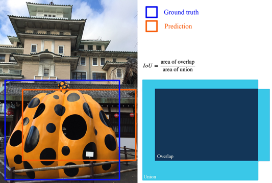
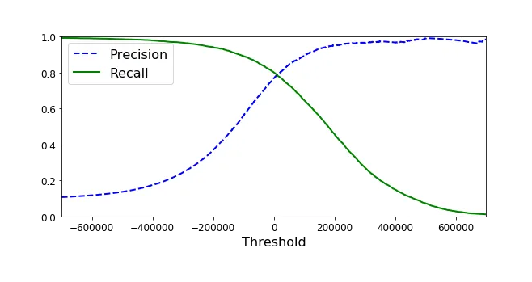
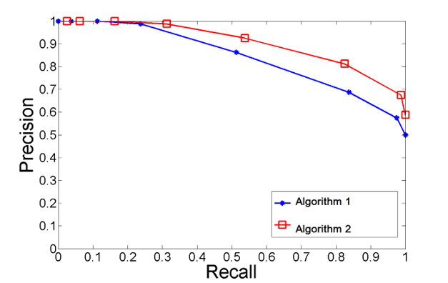
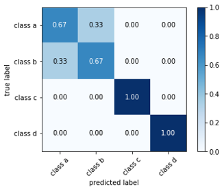
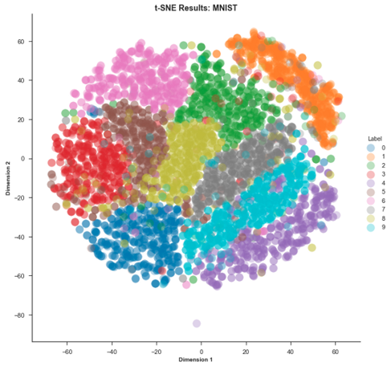
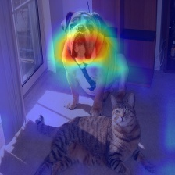

# Evaluation Metrics

*Deep Learning for Visual Recognition · Aarhus University*

These notes cover the evaluation metrics used in computer vision — from simple classification accuracy through to the detection metrics used in research papers today. The ILSVRC challenge provides a useful historical frame: each year a new task was added to the competition, and each new task demanded a new metric.

---

## 1  The ImageNet Challenge: How Metrics Evolved with Tasks

[ImageNet](http://www.image-net.org/) is an image database organised according to the WordNet noun hierarchy, with hundreds to thousands of images per node. The [ImageNet Large Scale Visual Recognition Challenge (ILSVRC)](https://www.image-net.org/challenges/LSVRC/index.php) used this dataset to benchmark computer vision algorithms at scale.

What makes ILSVRC a useful entry point for evaluation metrics is that each year a new task was added to the competition — and each new task forced the field to develop a new way of measuring performance:

- **2010 — Classification**: predict which of 1,000 object categories an image belongs to. Scored by top-1 and top-5 error rate.
- **2011 — + Localisation**: also draw a bounding box around the object. Introduced Intersection over Union (IoU) to decide whether a predicted box counts as correct.
- **2012 — + Fine-grained classification**: distinguish 100+ dog breeds from a bounding box crop. Predictions became confidence scores, evaluated with precision–recall curves and Average Precision (AP).
- **2013 — + Object detection**: find and label every instance of 200 categories in an image. AP is computed per class and averaged into mAP — still the standard metric for detection papers today.

The following sections unpack each of these metrics in turn.

---

## 2  Top-1 and Top-5 Error

For classification, the model outputs a ranked list of class probabilities. Top-1 error counts a prediction as wrong if the highest-scoring class is not the true class. Top-5 error counts it as wrong only if the true class does not appear anywhere in the top five predictions.

Top-5 error is a more forgiving metric and was the primary ILSVRC classification metric. It acknowledges that ImageNet's 1,000 classes include many visually similar categories (300+ dog breeds, dozens of snake species) where even humans would hesitate.

---

## 3  Intersection over Union (IoU)

Once the task requires predicting a bounding box, we need a metric for how well the predicted box matches the ground-truth box. Intersection over Union is:

$$\text{IoU} = \frac{\text{Area of Overlap}}{\text{Area of Union}}$$

IoU = 1.0 means perfect overlap; IoU = 0 means the boxes do not overlap at all. In ILSVRC localisation (2011), a predicted box was declared a true positive if IoU ≥ 0.5 — a threshold that has remained the de facto standard ever since.

IoU is the gateway to all detection metrics: it converts the continuous problem of box prediction into a binary true-positive / false-positive decision, which then feeds into the precision and recall calculations below.

---

## 4  Precision and Recall

Precision and recall are defined in terms of four outcome categories. Given a positive class (the object of interest):

- **True positive (TP)**: model predicted positive, ground truth is positive.
- **False positive (FP)**: model predicted positive, ground truth is negative.
- **False negative (FN)**: model predicted negative, ground truth is positive.
- **True negative (TN)**: model predicted negative, ground truth is negative.

$$\text{Precision} = \frac{N_{\mathrm{TP}}}{N_{\mathrm{TP}} + N_{\mathrm{FP}}}$$

$$\text{Recall} = \frac{N_{\mathrm{TP}}}{N_{\mathrm{TP}} + N_{\mathrm{FN}}}$$

**Precision** answers: of everything the model said was positive, what fraction actually was? A precision of 1.0 means every prediction was correct, but says nothing about how many true positives were missed.

**Recall** answers: of everything that actually was positive, what fraction did the model find? A recall of 1.0 means every true positive was found, but says nothing about how many false alarms were raised.

For object detection specifically: precision tells us how many of the predicted bounding boxes are actual objects; recall tells us how many of the actual objects in the image were found.

Related metrics sometimes reported alongside these:

$$\text{Accuracy} = \frac{N_{\mathrm{TP}} + N_{\mathrm{TN}}}{N_{\mathrm{TP}} + N_{\mathrm{TN}} + N_{\mathrm{FP}} + N_{\mathrm{FN}}}$$

$$\text{Specificity (true negative rate)} = \frac{N_{\mathrm{TN}}}{N_{\mathrm{TN}} + N_{\mathrm{FP}}}$$

---

## 5  The Precision–Recall Trade-off

Classification models output a confidence score rather than a hard binary label. The default threshold (score ≥ 0.5 → predict positive) is a convention, not a law. Shifting the threshold changes the precision–recall balance:

- **Lower threshold**: the model predicts positive more often. Recall rises (fewer true positives are missed) but precision falls (more false alarms).
- **Higher threshold**: the model predicts positive only when very confident. Precision rises but recall falls (some true positives are now below the threshold and missed).

The two quantities cannot both be maximised simultaneously — this is the precision–recall trade-off. In practice the right operating point depends on the application. In a cancer screening test, missing a true positive (low recall) is more costly than a false alarm, so you set a low threshold. In an automated factory reject system, a false alarm (low precision) that discards good product may be more costly than a missed defect, so you set a higher threshold.

---

## 6  Precision–Recall Curves

A precision–recall (PR) curve plots precision (y-axis) against recall (x-axis) as the decision threshold sweeps from 0 to 1. Each point on the curve corresponds to one threshold setting.

Key reference points for reading a PR curve:

- A **random classifier** on a balanced dataset produces a flat horizontal line at precision = 0.5 (equal positive and negative classes). For an imbalanced dataset the no-skill baseline is at precision equal to the fraction of positives.
- A **perfect classifier** sits at the single point (recall = 1.0, precision = 1.0) in the top-right corner.
- A **skilful classifier** bows towards that top-right corner. The more the curve bulges upward and to the right, the better the model.
- **Model selection**: among all threshold settings, the one closest to (1.0, 1.0) in Euclidean distance is generally the best operating point.

When comparing two models, the model whose PR curve lies above the other's at every recall level is unambiguously better. When the curves cross, summary statistics are needed.

---

## 7  Summary Metrics: AP, F1, and AUC

Three scalar summaries of the PR curve are commonly reported:

**Average Precision (AP)** summarises the entire curve as a weighted mean of precisions at each threshold, using the change in recall as the weight:

$$\text{AP} = \sum_n (R_n - R_{n-1}) \cdot P_n$$

where $P_n$ and $R_n$ are the precision and recall at the $n$-th threshold. AP rewards models that maintain high precision across all recall levels.

**F1 score** is the harmonic mean of precision and recall at a single threshold:

$$F_1 = 2 \cdot \frac{\text{Precision} \cdot \text{Recall}}{\text{Precision} + \text{Recall}}$$

The harmonic mean is used rather than the arithmetic mean because precision and recall are ratios — the harmonic mean gives a lower score when one of the two is very low, even if the other is high. F1 summarises model skill at one specific operating point; AP and AUC summarise skill across all thresholds.

**Area Under Curve (AUC)** is the integral of the PR curve — the area of the region below it. AUC = 1.0 for a perfect classifier; AUC = 0.5 for a random one on a balanced dataset. AUC and AP are closely related; AP is effectively a Riemann sum approximation of the same area.

---

## 8  Mean Average Precision (mAP)

Object detection requires detecting objects from many different classes. AP is computed per class (treat every detection of class $c$ as positive; all others as negative), then averaged over all classes:

$$\text{mAP} = \frac{1}{C} \sum_{c=1}^C \text{AP}_c$$

This is **mean Average Precision**. In some contexts (e.g. PASCAL VOC) AP and mAP are used interchangeably since the dataset has a fixed set of classes and AP is always reported as the mean across them.

---

## 9  COCO Detection Evaluation

The [MS COCO benchmark](https://cocodataset.org/#home) (330K images, 80 object categories, 1.5M annotated instances) is now the standard evaluation suite for detection and segmentation research. COCO's primary metric is stricter than PASCAL VOC's single IoU threshold:

- **AP@[.5:.95]**: AP averaged over ten IoU thresholds from 0.5 to 0.95 in steps of 0.05. This is the **primary COCO challenge metric**. Requiring IoU ≥ 0.75 penalises loose boxes that would pass at IoU ≥ 0.5, encouraging more precise localisation.
- **AP$_{50}$**: AP at IoU = 0.50 only (the PASCAL VOC metric, reported for comparability).
- **AP$_{75}$**: AP at IoU = 0.75 (a stricter single-threshold metric).
- **AP$_S$, AP$_M$, AP$_L$**: AP broken down by object size (small: area < 32², medium: 32² – 96², large: area > 96²), revealing whether a model struggles specifically with small objects.

Under COCO's conventions, AP already averages over classes, so AP and mAP mean the same thing.

When reading a detection paper, the column headed **AP** (or **mAP**) without further annotation typically refers to AP@[.5:.95].

---

## 10  Other Evaluation Tools

### 10.1  Confusion Matrices

A confusion matrix shows the full $C \times C$ table of true class (rows) versus predicted class (columns) for all test examples. The diagonal entries are correct predictions; off-diagonal entries reveal which classes are being confused with each other. For a 4-class problem, a confusion matrix immediately shows, for example, that class A is frequently misclassified as class B — information that a single accuracy number hides entirely.

Confusion matrices are most useful when accuracy alone is misleading — for instance, on imbalanced datasets where a model that always predicts the majority class achieves high accuracy but fails completely on minority classes.

### 10.2  t-SNE Visualisation

t-Distributed Stochastic Neighbour Embedding (t-SNE) is an unsupervised, non-linear dimensionality reduction technique. It maps high-dimensional feature vectors (e.g. the 4096-d FC7 embeddings from a CNN) to 2D while preserving local neighbourhood structure. A t-SNE plot of a model's embeddings reveals whether the learned representation clusters similar examples together.

What to look for in a t-SNE plot:

- **Tight, well-separated clusters** per class: the encoder has learned discriminative features.
- **Overlapping clusters**: the model struggles to distinguish those classes — the confusion matrix will likely confirm this.
- **Outliers far from all clusters**: unusual examples the model has not seen enough of.

t-SNE is a diagnostic tool, not a performance metric. It complements quantitative metrics by showing the geometry of what the model has learned.

### 10.3  CNN Visualisation

Several techniques give insight into what a CNN has learned internally:

- **Layer activation maps**: plot the feature maps produced by each layer for a given input. Early layers show edge and colour detectors; later layers show sparse, specialised activations.
- **Learned filter visualisation**: for the first convolutional layer, filters can be rendered directly as colour images. Well-trained networks show smooth, structured Gabor-like patterns; noisy filters indicate poor convergence.
- **Grad-CAM heatmaps**: highlight the regions of the input image most responsible for a specific prediction. Useful for checking whether the model is attending to the right part of the image.

*Grad-CAM highlights the pixels that most strongly support the model's dog prediction.*

- **Maximally activating images**: find the input that most strongly activates a given neuron (by gradient ascent on the input), revealing the filter's preferred stimulus.

These are covered in detail in Lecture 10.

### 10.4  Evaluating Generative Models

Unlike classifiers, generative models (GANs, VAEs, diffusion models) have no single ground-truth label to compare against. Evaluation is harder and more subjective. Two widely used quantitative metrics are:

- **Fréchet Inception Distance (FID)**: computes the distance between the distribution of real images and the distribution of generated images in the feature space of a pretrained Inception network. Lower FID indicates generated images whose statistics are closer to real ones.
- **Inception Score (IS)**: measures whether generated images look like a specific class (high conditional confidence) while being diverse across classes (high marginal entropy). Higher IS is better, but IS is sensitive to mode collapse in ways FID is not.

Both metrics are imperfect proxies for perceptual quality and diversity. Human evaluation remains the gold standard for generative models.

---

## 11  Choosing the Right Metric

The choice of metric should match the requirements of the task, not just convention:

| Task | Primary metric | When to use alternatives |
|---|---|---|
| Classification (balanced) | Top-1 accuracy | — |
| Classification (imbalanced) | Macro F1 or per-class AP | Accuracy is misleading |
| Binary classification | F1, AUC-ROC, or AUC-PR | AUC-PR preferred when positives are rare |
| Object detection | mAP@[.5:.95] (COCO) | AP@50 for comparison with older work |
| Semantic segmentation | Mean IoU (mIoU) | Pixel accuracy is misleading when classes are imbalanced |
| Generation | FID + human evaluation | IS as a secondary metric |

A common pitfall: using accuracy on an imbalanced dataset and reporting a high number that reflects the majority class, not the model's actual capability. Always check the class distribution before choosing a metric.

---

## References

- Russakovsky, O. et al. (2015). ImageNet Large Scale Visual Recognition Challenge. *IJCV*. arxiv.org/abs/1409.0575
- Lin, T.-Y. et al. (2014). Microsoft COCO: Common Objects in Context. ECCV. arxiv.org/abs/1405.0312
- Wikipedia: Precision and recall — en.wikipedia.org/wiki/Precision_and_recall
- Heusel, M. et al. (2017). GANs Trained by a Two Time-Scale Update Rule Converge to a Local Nash Equilibrium (FID). NeurIPS.
