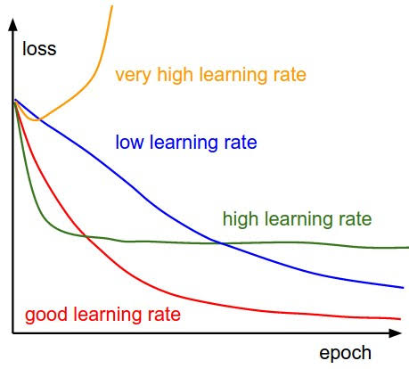
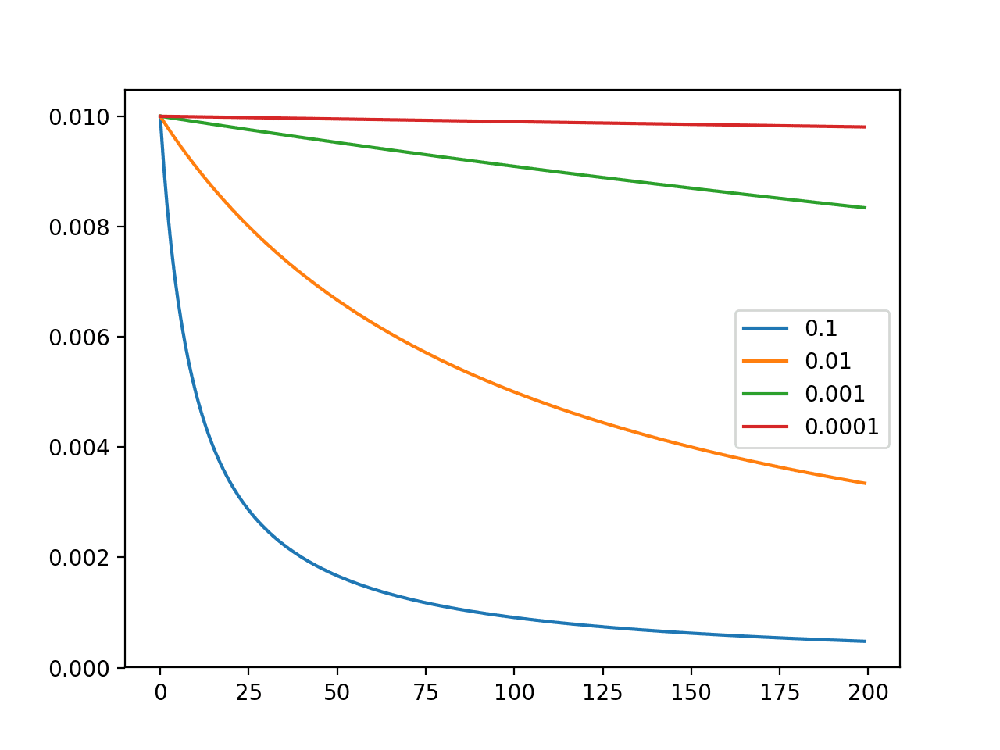

# Lecture 2
# Machine Learning Fundamentals

*Deep Learning for Visual Recognition · Aarhus University*

These notes cover the core mathematical ideas of this lecture — loss functions, gradient descent, logistic regression, regularisation, softmax, and nearest neighbours — alongside PyTorch code that maps each concept directly to practice.

---

## 1  The Learning Principle

Every supervised machine learning algorithm is built around the same simple idea: given a dataset of input–output pairs $\{(\mathbf{x}^{(i)}, y^{(i)})\}$, find a function $h(\mathbf{x})$ — called the model or hypothesis — such that $h(\mathbf{x}^{(i)}) \approx y^{(i)}$ across the training set, and such that $h$ generalises to unseen data. The three moving parts are:

- **Model**: the family of functions $h_\mathbf{w}(\mathbf{x})$ parameterised by weights $\mathbf{w}$.
- **Loss function**: a scalar $J(\mathbf{w})$ that measures how badly the model's predictions differ from the true labels.
- **Optimiser**: an algorithm that adjusts $\mathbf{w}$ to minimise $J(\mathbf{w})$.

This lecture introduces the simplest instantiation of each: a linear model, the L2 or cross-entropy loss, and gradient descent. Everything in later lectures — deep CNNs, transformers, diffusion models — is built on exactly these three components.

---

## 2  Linear Regression

### 2.1  The Model

Linear regression addresses the problem of predicting a continuous scalar output $y \in \mathbb{R}$ from a feature vector $\mathbf{x} \in \mathbb{R}^m$. The model is a linear function of the weights:

$$h_\mathbf{w}(\mathbf{x}) = w_1 x_1 + w_2 x_2 + \cdots + w_m x_m = \mathbf{w}^T \mathbf{x}$$

The model is linear in the weights $\mathbf{w}$, even if the inputs $\mathbf{x}$ are non-linear (e.g. polynomial features). This distinction matters: gradient descent works cleanly on linear-in-weights models because the loss landscape is convex.

### 2.2  The Loss Function (L2 / MSE)

We need a way to score how well a given choice of $\mathbf{w}$ fits the training data. The standard choice for regression is the L2 loss (also called mean squared error, MSE):

$$J(\mathbf{w}) = \frac{1}{2} \sum_i \left( h_\mathbf{w}(\mathbf{x}^{(i)}) - y^{(i)} \right)^2 = \frac{1}{2} \sum_i \left( \mathbf{w}^T \mathbf{x}^{(i)} - y^{(i)} \right)^2$$

The factor of $\frac{1}{2}$ is just for mathematical convenience: it cancels with the exponent 2 when we differentiate, giving a cleaner gradient formula. Minimising $J(\mathbf{w})$ is our goal.

### 2.3  Gradient Descent

We cannot usually find the minimum of $J(\mathbf{w})$ in closed form for large models, so we use an iterative procedure: gradient descent. Imagine standing on a hilly landscape (the loss surface) and wanting to reach the lowest point. At each step, you look at which direction slopes steepest downhill and take a small step in that direction:

$$\mathbf{w}_{k+1} = \mathbf{w}_k - \alpha \cdot \nabla J(\mathbf{w}_k)$$

where $\alpha$ is the learning rate (step size) and $\nabla J(\mathbf{w}_k)$ is the gradient — a vector pointing in the direction of steepest ascent. Subtracting it moves us downhill. For the L2 loss, the gradient with respect to weight $w_j$ is:

$$\frac{\partial J}{\partial w_j} = \sum_i x_j^{(i)} \cdot \left( \mathbf{w}^T \mathbf{x}^{(i)} - y^{(i)} \right)$$

This is the prediction error $(\mathbf{w}^T \mathbf{x}^{(i)} - y^{(i)})$ weighted by the feature value $x_j^{(i)}$. Intuitively, if a feature $x_j$ is large and the model made a big error, $w_j$ gets a large corrective update.

> **Key insight: the chain rule.** The gradient $\partial J / \partial w_j$ is derived using the chain rule of differentiation. Let $p = \mathbf{w}^T\mathbf{x} - y$ (the error) and $q = \frac{1}{2}p^2$ (the squared error). Then $\partial q / \partial w = (\partial p / \partial w)(\partial q / \partial p) = x \cdot p = x(\mathbf{w}^T\mathbf{x} - y)$. This chain rule idea scales up directly to backpropagation in deep networks.

```python
import torch
import torch.nn as nn
from matplotlib import pyplot as plt

# ── Linear regression from scratch ────────────────────────────────────

# Toy dataset: y = 2x + 1  plus some noise
torch.manual_seed(0)
X = torch.randn(100, 1)                    # 100 examples, 1 feature
y = 2 * X + 1 + 0.2 * torch.randn(100, 1) # true relationship + noise

# Model: a single linear layer (no bias separately; nn.Linear includes it)
model = nn.Linear(in_features=1, out_features=1)

# Loss and optimiser
loss_fn   = nn.MSELoss()                          # L2 / mean squared error
optimiser = torch.optim.SGD(model.parameters(), lr=0.1)

# Training loop
for epoch in range(200):
    optimiser.zero_grad()           # 1. clear gradients from last step
    y_pred = model(X)               # 2. forward pass: compute predictions
    loss   = loss_fn(y_pred, y)     # 3. compute scalar loss
    loss.backward()                 # 4. backward pass: compute gradients
    optimiser.step()                # 5. update weights

    if epoch % 50 == 0:
        print(f'Epoch {epoch:3d}  Loss: {loss.item():.4f}')

# Inspect learned weights — should be close to w=2, b=1
w, b = model.weight.item(), model.bias.item()
print(f'Learned: y = {w:.3f}·x + {b:.3f}')   # ≈ y = 2.0·x + 1.0

plt.plot(X.numpy(), y.numpy(), 'o', label='data')
plt.plot(X.numpy(), model(X).detach().numpy(), label='model')
plt.legend()
plt.show()
```

*Code 1 – Linear regression in PyTorch. The five-line training loop (zero_grad → forward → loss → backward → step) is the universal PyTorch training pattern. `nn.MSELoss()` implements the L2 loss.*

### 2.4  The Learning Rate

The learning rate $\alpha$ is one of the most important hyperparameters in machine learning. Setting it incorrectly leads to two failure modes:

- **Too large**: Updates overshoot the minimum. The loss oscillates or diverges. Symptom: loss goes up and down erratically instead of decreasing.
- **Too small**: Updates are tiny. Training converges correctly but very slowly. Symptom: smooth but painfully slow decrease in loss.

It is generally good practice to start with a moderate learning rate (e.g. `1e-3`) and decay it over training so that early progress is fast and later fine-tuning is precise. We revisit this in Lecture 6.



### 2.5  Overfitting and Underfitting

These concepts are most easily illustrated with polynomial regression, where the degree of the polynomial is a hyperparameter controlling model capacity:

- **Underfitting (too low capacity)**: A degree-1 polynomial fit to data generated by a cubic will miss the curvature — the training loss is high.
- **Appropriate capacity**: The right polynomial degree captures the underlying pattern and generalises to new points.
- **Overfitting (too high capacity)**: A degree-15 polynomial can pass through every training point exactly, achieving zero training loss, but will wildly mispredict new data — it has memorised noise.

```python
import torch
from matplotlib import pyplot as plt

# ── Polynomial regression ───────────────────────

# The model is still LINEAR IN THE WEIGHTS — just the features are non-linear.

def poly_features(x, degree):
    return torch.cat([x ** d for d in range(degree + 1)], dim=1)

torch.manual_seed(1)

x_train = torch.linspace(-1, 1, 20).unsqueeze(1)
y_train = torch.sin(3 * x_train) + 0.1 * torch.randn_like(x_train)

# Dense grid for plotting
x_plot = torch.linspace(-1, 1, 500).unsqueeze(1)

plt.plot(
    x_train.numpy(),
    y_train.numpy(),
    'o',
    label='training data'
)

# Show the true underlying function
plt.plot(
    x_plot.numpy(),
    torch.sin(x_plot).numpy(),
    '--',
    label='true function'
)

for degree in [1, 3, 15]:

    X_train = poly_features(x_train, degree)
    X_plot  = poly_features(x_plot, degree)

    # Exact least-squares solution
    w = torch.linalg.lstsq(X_train, y_train).solution

    y_train_pred = X_train @ w
    y_plot_pred  = X_plot @ w

    loss = torch.mean((y_train_pred - y_train) ** 2)

    print(
        f'Degree {degree:2d}  '
        f'train loss: {loss.item():.6f}'
    )

    plt.plot(
        x_plot.numpy(),
        y_plot_pred.numpy(),
        label=f'degree {degree}'
    )

plt.ylim(-1.5, 1.5)
plt.legend()
plt.show()

# Degree  1  → high loss (underfitting)
# Degree  3  → low loss (good fit)
# Degree 15  → near-zero loss (overfitting — memorised noise)
```

*Code 2 – Polynomial regression illustrating underfitting and overfitting. The model is still linear in the weights; only the input features are non-linear. A degree-15 fit will reach near-zero training loss but will perform poorly on new data.*

---

## 3  Hyperparameters, Train/Validation/Test Splits, and Cross-Validation

### 3.1  What Are Hyperparameters?

A hyperparameter is any setting that is chosen before training begins and is not updated by gradient descent. Contrast this with the model's parameters (weights), which are learned from data. Examples include:

- The learning rate $\alpha$.
- The degree of a polynomial (model capacity / architecture choice).
- The regularisation strength $\lambda$ (introduced in Section 4).
- The number of training epochs.

Choosing good hyperparameters is crucial — and the correct way to do it requires a careful data split strategy.

### 3.2  Train, Validation, and Test Sets

Using the test set to choose hyperparameters is a form of data leakage: the test set will no longer be a trustworthy estimate of real-world performance, because it has influenced the model design. The correct procedure is:

- **Training set**: used to compute gradients and update model weights.
- **Validation set**: used to evaluate the model during hyperparameter search. No gradients are computed; this set is only used to score different hyperparameter choices.
- **Test set**: touched exactly once, after all design decisions are final, to produce the reported performance number.

> **Why keep the test set secret?** Every time you look at test performance and make a decision based on it, you are implicitly fitting to the test set. With enough such decisions, you will overfit the test set and your reported performance will be optimistic. In deep learning this is a real and common problem.

### 3.3  Cross-Validation

When the dataset is small, a single validation split may be noisy — by bad luck, the validation set might be unrepresentative. Cross-validation addresses this by rotating which fold acts as validation:

- Split the (non-test) data into $k$ folds (e.g. $k = 5$).
- For each fold: train on the remaining $k-1$ folds, evaluate on this fold.
- Average the $k$ validation scores. This is the cross-validation estimate of performance.

Cross-validation is less common in deep learning (because training is expensive), but it is the right tool for small datasets or when comparing hyperparameter settings rigorously.

```python
import torch
from torch.utils.data import TensorDataset, random_split
from matplotlib import pyplot as plt

# ── Polynomial features ────────────────────────────────────────────────

def poly_features(x, degree):
    """Expand scalar x into [x^0, x^1, ..., x^degree]."""
    return torch.cat([x ** d for d in range(degree + 1)], dim=1)

def fit_polynomial(x, y, degree):
    """Fit polynomial coefficients using least squares."""
    X = poly_features(x, degree)
    return torch.linalg.lstsq(X, y).solution

def predict_polynomial(x, w):
    degree = len(w) - 1
    X = poly_features(x, degree)
    return X @ w

def mse(y_pred, y):
    return ((y_pred - y) ** 2).mean().item()

# ── Generate data ─────────────────────────────────────────────────────

torch.manual_seed(42)

N = 60

# x in [-1, 1] keeps polynomial features numerically well behaved
x_all = 2 * torch.rand(N, 1) - 1

# Underlying function + noise
y_all = torch.sin(3 * x_all) + 0.2 * torch.randn_like(x_all)

# ── Standard train / validation / test split ──────────────────────────

# 60 / 20 / 20 split
n_train = int(0.6 * N)
n_val   = int(0.2 * N)
n_test  = N - n_train - n_val

dataset = TensorDataset(x_all, y_all)

train_ds, val_ds, test_ds = random_split(
    dataset,
    [n_train, n_val, n_test],
    generator=torch.Generator().manual_seed(1)
)

# Convert subsets back into tensors
def subset_to_tensors(ds):
    x = torch.stack([sample[0] for sample in ds])
    y = torch.stack([sample[1] for sample in ds])
    return x, y

x_train, y_train = subset_to_tensors(train_ds)
x_val,   y_val   = subset_to_tensors(val_ds)
x_test,  y_test  = subset_to_tensors(test_ds)

print(
    f'Train: {len(train_ds)}  '
    f'Val: {len(val_ds)}  '
    f'Test: {len(test_ds)}'
)

# ── Hyperparameter tuning ─────────────────────────────────────────────

# Polynomial degree is the hyperparameter
degrees = range(1, 16)

train_losses = []
val_losses   = []

for degree in degrees:

    # Fit parameters ONLY using training data
    w = fit_polynomial(x_train, y_train, degree)

    # Evaluate on training data
    train_pred = predict_polynomial(x_train, w)
    train_loss = mse(train_pred, y_train)

    # Evaluate on validation data
    val_pred = predict_polynomial(x_val, w)
    val_loss = mse(val_pred, y_val)

    train_losses.append(train_loss)
    val_losses.append(val_loss)

    print(
        f'Degree {degree:2d}: '
        f'train loss = {train_loss:.4f}, '
        f'val loss = {val_loss:.4f}'
    )

# Choose hyperparameter using validation set
best_degree = degrees[
    torch.tensor(val_losses).argmin().item()
]

print(f'\nBest polynomial degree: {best_degree}')

# ── Final evaluation on test set ──────────────────────────────────────

# Refit using the selected degree
w_best = fit_polynomial(x_train, y_train, best_degree)

test_pred = predict_polynomial(x_test, w_best)
test_loss = mse(test_pred, y_test)

print(f'Test loss: {test_loss:.4f}')

# ── Plot validation curve ─────────────────────────────────────────────

plt.figure()
plt.plot(degrees, train_losses, 'o-', label='train')
plt.plot(degrees, val_losses,   'o-', label='validation')
plt.xlabel('Polynomial degree')
plt.ylabel('MSE')
plt.legend()
plt.show()

# ── Plot selected model ───────────────────────────────────────────────

x_plot = torch.linspace(-1, 1, 500).unsqueeze(1)
y_plot = predict_polynomial(x_plot, w_best)

plt.figure()
plt.plot(x_plot, torch.sin(3 * x_plot), '--', label='true function')
plt.plot(x_plot, y_plot, label=f'degree {best_degree}')
plt.plot(x_train, y_train, 'o', label='train')
plt.plot(x_val,   y_val,   'x', label='validation')
plt.plot(x_test,  y_test,  '+', label='test')
plt.legend()
plt.show()
```

*Code 3 – Performing hyperparameter tuning and testing for polynomial fitting.*

Here are some useful building blocks for PyTorch.
```python
import torch
from torch.utils.data import DataLoader, TensorDataset, random_split

# ── Standard train/val/test split ─────────────────────────────────────
torch.manual_seed(42)
N = 1000
X_all = torch.randn(N, 10)
y_all = torch.randint(0, 2, (N,))

# 70 / 15 / 15 split
n_train, n_val = int(0.7 * N), int(0.15 * N)
n_test  = N - n_train - n_val
dataset = TensorDataset(X_all, y_all)
train_ds, val_ds, test_ds = random_split(dataset, [n_train, n_val, n_test])

train_loader = DataLoader(train_ds, batch_size=32, shuffle=True)
val_loader   = DataLoader(val_ds,   batch_size=64)
test_loader  = DataLoader(test_ds,  batch_size=64)

print(f'Train: {len(train_ds)}  Val: {len(val_ds)}  Test: {len(test_ds)}')

# ── Validation loop (no gradient computation) ─────────────────────────
def evaluate(model, loader, loss_fn):
    model.eval()                    # disables dropout, batch-norm update
    total_loss, correct = 0, 0
    with torch.no_grad():           # no gradient tracking needed
        for X_batch, y_batch in loader:
            logits = model(X_batch)
            total_loss += loss_fn(logits, y_batch).item()
            correct    += (logits.argmax(1) == y_batch).sum().item()
    return total_loss / len(loader), correct / len(loader.dataset)
```
*Code 4 – Splitting a dataset into train/validation/test in PyTorch. The validation loop uses `torch.no_grad()` to skip gradient computation and `model.eval()` to disable training-time behaviour (e.g. dropout).*

---

## 4  Logistic Regression

### 4.1  From Regression to Classification

Linear regression predicts a continuous value. When we instead want to assign one of two discrete class labels (e.g. '0' vs '1', 'dog' vs 'cat'), we need a classification algorithm. Logistic regression is the simplest such algorithm.

A naive approach — threshold the linear model: predict 1 if $\mathbf{w}^T\mathbf{x} > 0$, else 0 — fails with gradient descent because the threshold function has zero gradient almost everywhere. Instead, we use a smooth approximation that outputs a probability:

$$h_\mathbf{w}(\mathbf{x}) = P(y = 1 \mid \mathbf{x}) = \sigma(\mathbf{w}^T\mathbf{x}) = \frac{1}{1 + \exp(-\mathbf{w}^T\mathbf{x})}$$

The sigmoid function $\sigma(z)$ squashes any real number into $(0, 1)$, making it interpretable as a probability. The predicted class label is then: predict 1 if $h_\mathbf{w}(\mathbf{x}) > 0.5$, else 0. Since $\sigma(z) > 0.5$ if and only if $z > 0$, this is equivalent to the sign of $\mathbf{w}^T\mathbf{x}$.

> **Geometric intuition.** The weight vector $\mathbf{w}$ defines a linear decision boundary: the hyperplane $\mathbf{w}^T\mathbf{x} = 0$. Points on one side are classified as class 1; points on the other side as class 0. The sigmoid converts the signed distance from this boundary into a probability.

### 4.2  The Cross-Entropy Loss

We could train logistic regression with MSE loss, but it is a poor choice: the loss landscape becomes non-convex and training is slow. The right loss for binary classification is the binary cross-entropy (log loss), derived from maximum likelihood estimation:

$$J(\mathbf{w}) = -\sum_i \left[ y^{(i)} \log h_\mathbf{w}(\mathbf{x}^{(i)}) + (1 - y^{(i)}) \log(1 - h_\mathbf{w}(\mathbf{x}^{(i)})) \right]$$

How to read this: for each training example, only one of the two log terms is active (the other is multiplied by zero). When $y = 1$, the loss is $-\log(\text{predicted probability of class 1})$: small loss if we predicted close to 1, large loss if we predicted close to 0. The negative log of a number in $(0, 1)$ is always positive and blows up as the number approaches 0 — exactly the behaviour we want.

The gradient of $J(\mathbf{w})$ with respect to $w_j$ turns out to have the same elegant form as for linear regression:

$$\frac{\partial J}{\partial w_j} = \sum_i x_j^{(i)} \cdot \left( h_\mathbf{w}(\mathbf{x}^{(i)}) - y^{(i)} \right)$$

The only difference from the linear regression gradient is that $h_\mathbf{w}(\mathbf{x})$ is now the sigmoid of the linear prediction rather than the linear prediction itself.

```python
import torch
import torch.nn as nn
from matplotlib import pyplot as plt

# ── Binary logistic regression on synthetic data ──────────────────────
torch.manual_seed(0)
N = 200
# Class 0: centred at (-1, -1);  Class 1: centred at (1, 1)
X0 = torch.randn(N // 2, 2) - 1
X1 = torch.randn(N // 2, 2) + 1
X  = torch.cat([X0, X1])
y  = torch.cat([torch.zeros(N // 2), torch.ones(N // 2)]).long()

# nn.Linear gives us w^T x + b
# nn.BCEWithLogitsLoss = sigmoid + binary cross-entropy, numerically stable
model     = nn.Linear(2, 1)               # 2 input features, 1 output logit
loss_fn   = nn.BCEWithLogitsLoss()
optimiser = torch.optim.SGD(model.parameters(), lr=0.1)

for epoch in range(300):
    optimiser.zero_grad()
    logits = model(X).squeeze()           # shape: (N,)  — raw scores
    loss   = loss_fn(logits, y.float())
    loss.backward()
    optimiser.step()

# Compute accuracy
with torch.no_grad():
    probs    = torch.sigmoid(model(X).squeeze())
    preds    = (probs > 0.5).long()
    accuracy = (preds == y).float().mean()
    print(f'Accuracy: {accuracy:.2%}')   # should be ~99%

# Inspect the learned decision boundary
w = model.weight.data.squeeze()   # shape: (2,)
b = model.bias.data.item()
print(f'w = {w.numpy()},  b = {b:.3f}')

# The decision boundary is the line:  w[0]*x1 + w[1]*x2 + b = 0

# Plot
x_plot = torch.linspace(-4, 4, 100)
y_plot = - (w[0] * x_plot + b) / w[1]
plt.plot(X0[:, 0], X0[:, 1], 'o', label='Class 0')
plt.plot(X1[:, 0], X1[:, 1], 'o', label='Class 1')
plt.plot(x_plot, y_plot, 'k', label='Decision boundary')
plt.legend()
plt.show()
```

*Code 5 – Binary logistic regression. `BCEWithLogitsLoss` combines sigmoid and binary cross-entropy in a single numerically stable operation, which is why we pass raw logits (not probabilities) to it.*

### 4.3  Logistic Regression as an Image Classifier

On image data such as MNIST, we flatten the 28×28 pixel grid into a 784-dimensional vector and apply logistic regression directly. The weight vector $\mathbf{w}$ then has the same shape as the input image and can be visualised as a 'template': the model classifies an image by measuring how similar it is (via inner product) to the learned template.

```python
import torch
import torch.nn as nn
from torchvision import datasets, transforms
from torch.utils.data import DataLoader

# ── Load MNIST and flatten to vectors ─────────────────────────────────
transform = transforms.Compose([
    transforms.ToTensor(),
    transforms.Normalize((0.1307,), (0.3081,)),   # MNIST mean & std
    transforms.Lambda(lambda x: x.view(-1)),      # flatten 28x28 → 784
])

train_ds = datasets.MNIST('.', train=True,  download=True, transform=transform)
test_ds  = datasets.MNIST('.', train=False, download=True, transform=transform)
train_loader = DataLoader(train_ds, batch_size=256, shuffle=True)
test_loader  = DataLoader(test_ds,  batch_size=512)

# ── Softmax classifier (logistic regression for 10 classes) ───────────
# nn.Linear maps each 784-dim image to 10 class scores
model     = nn.Linear(784, 10)              # 784*10 + 10 = 7,850 parameters
loss_fn   = nn.CrossEntropyLoss()           # softmax + cross-entropy
optimiser = torch.optim.SGD(model.parameters(), lr=0.01)

for epoch in range(5):
    model.train()
    for X_batch, y_batch in train_loader:
        optimiser.zero_grad()
        loss = loss_fn(model(X_batch), y_batch)
        loss.backward()
        optimiser.step()

    # Validation accuracy
    model.eval()
    correct = 0
    with torch.no_grad():
        for X_batch, y_batch in test_loader:
            correct += (model(X_batch).argmax(1) == y_batch).sum().item()
    print(f'Epoch {epoch+1}  test accuracy: {correct/len(test_ds):.2%}')

# Typically reaches ~92% in 5 epochs — not bad for a linear model!
```

*Code 6 – Logistic/softmax regression on MNIST. `nn.CrossEntropyLoss` expects raw logits (not probabilities) and internally applies log-softmax. A linear model on raw pixels achieves ~92% on MNIST — the ceiling of what a linear classifier can do.*

---

## 5  Regularisation: Weight Decay

### 5.1  Why Regularise?

When a model has more capacity than the data can support — for example, a degree-15 polynomial fitted to 20 noisy points — it overfits: training loss is very low but generalisation is poor. Regularisation adds a penalty term to the loss that discourages overly complex models:

$$J_\text{reg}(\mathbf{w}) = J(\mathbf{w}) + \lambda \cdot R(\mathbf{w})$$

where $R(\mathbf{w})$ is a regularisation term and $\lambda > 0$ is the regularisation strength (a hyperparameter). A larger $\lambda$ means stronger regularisation — more pressure to keep weights small — at the cost of potentially underfitting.

### 5.2  L2 Regularisation (Weight Decay)

L2 regularisation (also called weight decay) penalises the sum of squared weights:

$$R(\mathbf{w}) = \sum_j w_j^2 = \|\mathbf{w}\|^2$$

Adding this to the gradient descent update gives:

$$w_j \leftarrow w_j - \alpha \cdot \left(\frac{\partial J}{\partial w_j} + 2\lambda w_j\right) = (1 - 2\alpha\lambda) \cdot w_j - \alpha \cdot \frac{\partial J}{\partial w_j}$$

The factor $(1 - 2\alpha\lambda)$ shrinks the weight at every step — hence 'weight decay'. L2 regularisation has an analytical solution and tends to give dense solutions where all weights are small but non-zero.

### 5.3  L1 Regularisation

L1 regularisation penalises the sum of absolute weight values:

$$R(\mathbf{w}) = \sum_j |w_j| = \|\mathbf{w}\|_1$$

L1 regularisation has a fundamentally different effect: it tends to produce sparse solutions where many weights are exactly zero. This is a form of automatic feature selection — the model learns to ignore most inputs. In high-dimensional settings this can be very useful, but in deep learning L2 is far more common.

> **L1 vs L2 geometrically.** Imagine the set of all weight vectors that fit the training data exactly (a line in $w_1$–$w_2$ space). L2 picks the one with the smallest Euclidean distance from the origin (always gives a non-sparse, 'spread-out' solution). L1 picks the one with the smallest Manhattan distance — and this solution typically touches a corner of the L1 ball, where one weight is zero.

```python
import torch
import torch.nn as nn

# ── L2 regularisation in PyTorch ──────────────────────────────────────

# Option 1: Pass weight_decay to the optimiser (most common, cleanest)
model     = nn.Linear(784, 10)
optimiser = torch.optim.SGD(
    model.parameters(),
    lr=0.01,
    weight_decay=1e-4    # λ  — applied as L2 penalty on all parameters
)

# Option 2: Manual L2 penalty added to the loss (more transparent)
loss_fn = nn.CrossEntropyLoss()
lambda_ = 1e-4

X_batch = torch.randn(32, 784)
y_batch = torch.randint(0, 10, (32,))

logits    = model(X_batch)
data_loss = loss_fn(logits, y_batch)
l2_penalty = sum(p.pow(2).sum() for p in model.parameters())
total_loss_l2 = data_loss + lambda_ * l2_penalty
print(f'Data loss: {data_loss:.4f} ')
print(f'L2 penalty: {(lambda_*l2_penalty):.4f}')

# ── L1 regularisation (manual — no built-in optimiser shortcut) ───────
l1_penalty = sum(p.abs().sum() for p in model.parameters())
total_loss_l1 = data_loss + lambda_ * l1_penalty
print(f'L1 penalty: {lambda_*l1_penalty:.4f}')

# Insert training loop here where you use either total_loss_l2 or total_loss_l1
```

*Code 7 – L2 and L1 regularisation in PyTorch. In practice, L2 is almost always applied via the `weight_decay` argument to the optimiser. L1 must be added manually to the loss, as PyTorch optimisers do not have a built-in L1 option.*

---

## 6  Softmax Regression (Multi-Class Classification)

### 6.1  From Binary to K Classes

Logistic regression handles two classes. For $K > 2$ classes we use softmax regression (also called multinomial logistic regression). Instead of a single weight vector $\mathbf{w}$, we learn a weight matrix $\mathbf{W}$ with one row $\mathbf{w}_k$ per class:

$$h_\mathbf{W}(\mathbf{x}) = \text{softmax}(\mathbf{W}\mathbf{x}) \quad \text{where} \quad \text{softmax}(\mathbf{z})_k = \frac{\exp(z_k)}{\sum_j \exp(z_j)}$$

Each class score $z_k = \mathbf{w}_k^T\mathbf{x}$ is the inner product of that class's weight vector with the input — a measure of how similar the input is to that class's template. The softmax function converts these $K$ raw scores (logits) into $K$ probabilities that sum to 1. We take the class with the highest probability as our prediction.

Two design questions answered by softmax:

- **Why $\exp(z)$ rather than $z$ directly?** Probabilities must be non-negative, and $\exp()$ guarantees this for any real-valued logit.
- **Why divide by $\sum \exp(z_j)$?** To normalise the outputs so they sum to 1 and form a valid probability distribution.

### 6.2  Loss Function: Cross-Entropy

The loss for softmax regression is the multi-class cross-entropy. Given the predicted probability distribution $h_\mathbf{W}(\mathbf{x}^{(i)})$ and the one-hot target vector for training example $i$ (all zeros except a 1 in the position of the true class $k$):

$$J(\mathbf{W}) = -\sum_i \sum_k \mathbf{1}[y^{(i)} = k] \cdot \log P(y = k \mid \mathbf{x}^{(i)})$$

Because of the indicator function $\mathbf{1}[\cdot]$, only the term corresponding to the true class is non-zero for each example. The loss thus reduces to: $-\log(\text{predicted probability of the correct class})$. This is large when the model assigns low probability to the right class, and small when it is confident and correct.

```python
import torch
import torch.nn as nn

# ── Softmax regression: the forward pass step by step ─────────────────
batch_size, n_features, n_classes = 4, 784, 10

W     = torch.randn(n_classes, n_features, requires_grad=True)
b     = torch.zeros(n_classes, requires_grad=True)
x     = torch.randn(batch_size, n_features)
y     = torch.tensor([0, 2, 1, 0])   # true class labels

# Step 1: Compute logits (class scores)
logits = x @ W.T + b               # shape: (batch, n_classes)

# Step 2: Softmax converts logits to probabilities
probs = torch.softmax(logits, dim=1)
print('Probabilities (should sum to 1 per row):')
print(probs.detach().round(decimals=3))
print('Row sums:', probs.sum(dim=1).detach())

# Step 3: Cross-entropy loss
# nn.CrossEntropyLoss = log_softmax + NLLLoss — takes raw logits, not probs
loss_fn = nn.CrossEntropyLoss()
loss    = loss_fn(logits, y)
print(f'\nCross-entropy loss: {loss.item():.4f}')

# Step 4: Backward pass
loss.backward()
print(f'Gradient of W: shape {W.grad.shape}')   # same as W

# ── Using nn.Linear (cleaner implementation) ──────────────────────────
model = nn.Sequential(
    nn.Linear(n_features, n_classes),   # W and b handled automatically
)
# nn.CrossEntropyLoss expects LOGITS (not softmax output)
loss2 = nn.CrossEntropyLoss()(model(x), y)
```

*Code 8 – Softmax regression broken down step by step. Important: `nn.CrossEntropyLoss` expects raw logits, not probabilities — it applies log-softmax internally for numerical stability. Never pass `torch.softmax(logits)` into `CrossEntropyLoss`.*

### 6.3  Linear Decision Boundaries and Their Limits

Each row $\mathbf{w}_k$ of the weight matrix $\mathbf{W}$ defines a linear decision boundary between class $k$ and the rest. For many real-world problems — images in particular — these linear boundaries are insufficient. Consider images of the digit '1' rotated 90° versus upright: they occupy completely different regions of pixel space, and no linear boundary cleanly separates them.

The solution is non-linear feature transformations — either hand-crafted (e.g. converting Cartesian to polar coordinates) or, far better, learned by a neural network. This is the direct motivation for moving from softmax regression to multi-layer neural networks (Lecture 3) and then convolutional networks (Lecture 4).

```python
import torch
import torch.nn as nn

# ── Visualising the limits of a linear classifier ─────────────────────
# XOR problem: NOT linearly separable
# Class 0: (0,0) and (1,1)   Class 1: (0,1) and (1,0)
X = torch.tensor([[0.,0.],[1.,1.],[0.,1.],[1.,0.]])
y = torch.tensor([0, 0, 1, 1])
print("Ground truth labels: ", y.tolist())

# Linear model (logistic regression)
lin_model = nn.Linear(2, 2)
opt       = torch.optim.Adam(lin_model.parameters(), lr=0.1)
loss_fn   = nn.CrossEntropyLoss()

for _ in range(1000):
    opt.zero_grad()
    loss_fn(lin_model(X), y).backward()
    opt.step()

preds_lin = lin_model(X).argmax(1)
print('Linear model predictions:', preds_lin.tolist())  # will fail on XOR

# Non-linear model (neural network with one hidden layer with ReLU)
mlp = nn.Sequential(nn.Linear(2,8), nn.ReLU(), nn.Linear(8,2))
opt2 = torch.optim.Adam(mlp.parameters(), lr=0.05)

for _ in range(2000):
    opt2.zero_grad()
    loss_fn(mlp(X), y).backward()
    opt2.step()

preds_mlp = mlp(X).argmax(1)
print('MLP predictions:', preds_mlp.tolist())   # correctly classifies XOR
```

*Code 9 – The XOR problem illustrates the fundamental limit of linear classifiers. No straight line can separate the two classes. A single hidden layer with ReLU solves it easily — motivating neural networks.*

---

## 7  K-Nearest Neighbours (K-NN)

### 7.1  The Algorithm

K-NN is the simplest classification algorithm imaginable: it requires no training at all. Given a new test image, it finds the $K$ training images most similar to it (by some distance metric) and assigns the majority class among those $K$ neighbours.

- $K = 1$: Assign the label of the single closest training example. Produces jagged, noisy decision boundaries.
- $K > 1$: Majority vote among $K$ neighbours. Smoother boundaries, more robust to individual noisy examples.

The 'white regions' visible in K-NN decision boundary plots correspond to ties in the majority vote — equally many neighbours from two or more classes.

### 7.2  Computational Complexity

The key practical disadvantage of K-NN:

- **Training**: $O(1)$ — just store all training examples.
- **Prediction**: $O(N)$ — must compute distance to every training example for each new query.

This is exactly backwards from what we want for deployment: cheap training is fine, but slow prediction is painful. For $N = 1{,}000{,}000$ training images, each prediction requires a million distance computations. Data structures like KD-trees can speed this up, but the fundamental scaling problem remains.

### 7.3  The Curse of Dimensionality

K-NN on raw pixels performs poorly for a deeper reason than just speed. CIFAR-10 images are $32 \times 32 \times 3 = 3072$-dimensional. In high-dimensional spaces, all data points become approximately equally distant from each other — the concept of 'nearest neighbour' breaks down because distances stop being informative. An image of a white cat and an image of a black dog may be closer in pixel space (same brightness distribution) than two images of the same cat in different lighting.

The solution previewed at the end of the lecture is to use a CNN to extract a compact, semantically meaningful representation (e.g. a 512-dimensional vector) before applying K-NN. In that learned space, semantic similarity and geometric proximity align.

```python
import numpy as np
from matplotlib import pyplot as plt
from sklearn.neighbors import KNeighborsClassifier
from sklearn.metrics import accuracy_score

# ── Toy data ──────────────────────────────────────────────────────────

np.random.seed(0)

X_train = np.random.randn(200, 2)
y_train = (X_train[:, 0] + X_train[:, 1] > 0).astype(int)

X_test = np.random.randn(20, 2)
y_test = (X_test[:, 0] + X_test[:, 1] > 0).astype(int)

# Plot
plt.plot(X_train[y_train==0, 0], X_train[y_train==0, 1], 'o', label='Class 0')
plt.plot(X_train[y_train==1, 0], X_train[y_train==1, 1], 'o', label='Class 1')
plt.legend()
plt.show()

# ── K-Nearest Neighbours ──────────────────────────────────────────────

for k in [1, 5, 15]:

    model = KNeighborsClassifier(
        n_neighbors=k,
        metric='euclidean'
    )

    model.fit(X_train, y_train)

    preds = model.predict(X_test)

    accuracy = accuracy_score(y_test, preds)

    print(f'K={k:2d}  accuracy: {accuracy:.0%}')
```

*Code 10 – K-NN example using `sklearn`. Notice that `fit()` is trivial (just storing data), while `predict()` does all the work — $O(N_\text{train})$ per test point.*

---

## 8  K-Means Clustering

### 8.1  Unsupervised Learning

All algorithms so far have been supervised: we learn from labelled pairs $(\mathbf{x}, y)$. Unsupervised learning uses unlabelled data — only the inputs $\mathbf{x}$ — to discover structure. This is valuable when labels are expensive or unavailable, which is common in practice.

K-Means is the simplest and most widely used clustering algorithm. It partitions $N$ data points into $K$ clusters by iteratively assigning points to their nearest cluster centre (centroid) and updating the centroids.

### 8.2  The Algorithm

- Initialise $K$ cluster centroids $\mu_1, \ldots, \mu_K$ (e.g. random points from the dataset).
- **Assignment step**: assign each point $\mathbf{x}_i$ to the nearest centroid: $c_i = \arg\min_k \|\mathbf{x}_i - \mu_k\|^2$
- **Update step**: recompute each centroid as the mean of all points assigned to it: $\mu_k = \frac{1}{|C_k|} \sum_{i \in C_k} \mathbf{x}_i$
- Repeat assignment and update steps until assignments stop changing (convergence).

K-Means minimises the within-cluster sum of squared distances. It is guaranteed to converge but only to a local minimum, so it is common practice to run it multiple times with different initialisations and keep the best result.

```python
import numpy as np
from matplotlib import pyplot as plt
from sklearn.cluster import KMeans

# ── Demo: cluster three Gaussian blobs ────────────────────────────────

np.random.seed(42)

blobs = np.concatenate([
    np.random.randn(50, 2) + np.array([-3.,  0.]),
    np.random.randn(50, 2) + np.array([ 3.,  0.]),
    np.random.randn(50, 2) + np.array([ 0.,  3.]),
])

# ── K-means clustering ────────────────────────────────────────────────

model = KMeans(
    n_clusters=3,
    random_state=0,
    n_init=10
)

assignments = model.fit_predict(blobs)
centroids = model.cluster_centers_

# ── Inspect result ────────────────────────────────────────────────────

for k in range(3):
    count = np.sum(assignments == k)
    print(
        f'Cluster {k}: {count} points, '
        f'centroid ≈ {centroids[k].tolist()}'
    )

# ── Plot ──────────────────────────────────────────────────────────────

plt.figure()

plt.scatter(
    blobs[:, 0],
    blobs[:, 1],
    c=assignments
)

plt.scatter(
    centroids[:, 0],
    centroids[:, 1],
    marker='X',
    s=150
)

plt.show()
```

*Code 11 – K-Means using `sklearn`.*

---

## 9  Summary

This lecture established the three core building blocks that every algorithm in this course is built on:

| Concept | What it does | PyTorch |
|---|---|---|
| Linear model | $h_\mathbf{w}(\mathbf{x}) = \mathbf{w}^T\mathbf{x}$ — basis of regression and classification | `nn.Linear(m, 1)` |
| L2 loss (MSE) | Measures regression error; convex, easy to optimise | `nn.MSELoss()` |
| Cross-entropy loss | Measures classification error; derived from max-likelihood | `nn.CrossEntropyLoss()` |
| Gradient descent | Iteratively update $\mathbf{w} \leftarrow \mathbf{w} - \alpha\nabla J(\mathbf{w})$ to minimise the loss | `torch.optim.SGD(lr=α)` |
| Sigmoid | Maps any real number to $(0,1)$; used for binary probs | `torch.sigmoid(z)` |
| Softmax | Maps $K$ scores to a probability distribution over $K$ classes | `torch.softmax(z, dim=1)` |
| L2 regularisation | Penalises large weights to prevent overfitting | `weight_decay=` in optim |
| L1 regularisation | Penalises absolute weight values; induces sparsity | manual: `p.abs().sum()` |
| K-NN | Non-parametric; predict by majority vote of $K$ neighbours | `sklearn.neighbors.KNeighborsClassifier` |
| K-Means | Unsupervised clustering; alternates assign and update | `sklearn.cluster.KMeans` |
| Train/Val/Test | Proper evaluation protocol to avoid data leakage | `random_split(dataset, ...)` |

The most important concept to carry forward is the three-step recipe: define a model, choose a loss, run gradient descent. In Lecture 3 we stack multiple linear layers with non-linear activations to build neural networks that can represent arbitrarily complex functions — but the recipe stays exactly the same.

---

## 10  Exercises
The exercises are representative of the types of questions you might encounter at the written exam (except that the exam questions will be formulated as multiple choice). You are welcome to work on the exercises during TØ on Thursdays.

### Exercise 1 — Gradient Descent by Hand

Consider a linear regression model $h_w(x) = wx$ (no bias) with a single weight $w$, trained on two data points: $(x^{(1)}, y^{(1)}) = (1, 2)$ and $(x^{(2)}, y^{(2)}) = (2, 3)$.

The L2 loss is:

$$J(w) = \frac{1}{2}\sum_i \left(wx^{(i)} - y^{(i)}\right)^2$$

**(a)** Compute $J(w)$ for $w = 1.0$.

**(b)** Compute the gradient $\partial J / \partial w$ at $w = 1.0$.

**(c)** Perform one gradient descent step with learning rate $\alpha = 0.1$. What is the new value of $w$?

**(d)** Is the new loss $J(w_\text{new})$ smaller than $J(1.0)$? Verify by calculation.

### Exercise 2 — Learning Rate Effects

The figure below shows four loss curves from training the same model with four different learning rates.



In you own words, explain what you see.

### Exercise 3 — Overfitting and Model Capacity

A polynomial regression model is trained on 20 data points. The table below shows training and validation loss for three polynomial degrees.

| Degree | Train loss | Val loss |
|--------|-----------|----------|
| 1      | 0.48      | 0.51     |
| 4      | 0.06      | 0.08     |
| 15     | 0.00      | 3.74     |

**(a)** Which degree is underfitting? How can you tell?

**(b)** Which degree is overfitting? How can you tell?

**(c)** A student argues that degree 15 is the best model because it achieves zero training loss. What is wrong with this reasoning?

**(d)** If you added L2 regularisation to the degree-15 model, would you expect the training loss to go up, down, or stay the same? What about the validation loss?

### Exercise 4 — Softmax and Cross-Entropy

A 3-class classifier produces the following raw output scores (logits) for one training image: $\mathbf{z} = [2.0,\ 1.0,\ 0.5]$. The true class is class 0.

**(a)** Compute the softmax probabilities $\hat{y}_k = \exp(z_k) / \sum_j \exp(z_j)$ for each class. Round to two decimal places.

**(b)** Compute the cross-entropy loss $L = -\log(\hat{y}_0)$.

**(c)** If the model instead output $\mathbf{z} = [5.0,\ 1.0,\ 0.5]$, would the cross-entropy loss be larger or smaller? Explain intuitively without calculation.

**(d)** The softmax function is translation-invariant: $\text{softmax}(\mathbf{z}) = \text{softmax}(\mathbf{z} + c)$ for any constant $c$. Verify this for $c = -2.0$ using the logits from part (a).

### Exercise 5 — Reading PyTorch Code

Consider the following training loop:

```python
model     = nn.Linear(10, 3)
loss_fn   = nn.CrossEntropyLoss()
optimiser = torch.optim.SGD(model.parameters(), lr=0.01, weight_decay=1e-3)

for epoch in range(100):
    optimiser.zero_grad()
    logits = model(X_train)
    loss   = loss_fn(logits, y_train)
    loss.backward()
    optimiser.step()
```

**(a)** How many input features does this model expect? How many output classes does it predict?

**(b)** What does `optimiser.zero_grad()` do, and what would happen if you removed it?

**(c)** What does `weight_decay=1e-3` do to the loss that is being optimised? Name the regularisation technique this implements.

**(d)** A student modifies the code by moving `loss.backward()` to before `optimiser.zero_grad()`. Will the model still train correctly? Explain.

### 10.6  Exercise 6 — K-Nearest Neighbours

**(a)** A 1-NN classifier is trained on a dataset of 1000 images. What is its training accuracy, and why?

**(b)** Explain in one sentence why a very large value of $K$ (e.g. $K = 1000$ on a dataset of 1000 points) leads to poor performance.

**(c)** K-NN with $K=1$ has high variance and low bias; K-NN with very large $K$ has low variance and high bias. Describe what the decision boundary looks like in each case for a two-class problem.

**(d)** K-NN requires storing all training examples and computing distances to all of them at test time. For a training set of $N$ images, each represented as a $D$-dimensional feature vector, what is the time complexity of classifying a single test image?

### Exercise 7 — Train / Validation / Test Protocol

A student trains several models, evaluates each on the test set, picks the best one, and reports its test accuracy as the final result.

**(a)** What is wrong with this procedure?

**(b)** Describe the correct three-way split protocol and explain the role of each split.

**(c)** In 5-fold cross-validation on a dataset of 500 examples, how many examples are used for training and how many for validation in each fold?

### Exercise 8 — Sigmoid and Logistic Regression

**(a)** Write down the sigmoid function $\sigma(z)$. What are its output range and its value at $z = 0$?

**(b)** A linear model produces the raw score $z = \mathbf{w}^T\mathbf{x} = 1.5$ for some input. Compute the predicted probability $\hat{y} = \sigma(1.5)$ and state how you would classify the example under a threshold of 0.5.

**(c)** Explain in two sentences why applying a sigmoid to $\mathbf{w}^T\mathbf{x}$ makes the output suitable for use as a probability, whereas the raw score $\mathbf{w}^T\mathbf{x}$ alone does not.

**(d)** Logistic regression uses the cross-entropy loss rather than the L2 loss. Give one reason why L2 loss is a poor choice for binary classification.

### Exercise 9 — L1 vs L2 Regularisation

Both L1 and L2 regularisation add a penalty term to the loss:

$$J_\text{reg}(\mathbf{w}) = J(\mathbf{w}) + \lambda \cdot R(\mathbf{w})$$

where $R(\mathbf{w}) = \|\mathbf{w}\|^2$ for L2 and $R(\mathbf{w}) = \|\mathbf{w}\|_1$ for L1.

**(a)** For a model with weights $\mathbf{w} = [3.0,\ -1.0,\ 0.0,\ 0.5]$ and $\lambda = 0.1$, compute the L1 and L2 penalty terms separately.

**(b)** L1 regularisation tends to produce *sparse* weight vectors (many weights exactly zero), while L2 tends to produce small but non-zero weights. Give an intuitive geometric or algebraic explanation for why L1 has this sparsity-inducing property.

**(c)** In PyTorch, `weight_decay=λ` in the optimiser implements L2 regularisation but not L1. How would you add an L1 penalty to the training loop? Write the two lines you would add inside the training loop.

### Exercise 10 — Bias, Variance, and the Bias-Variance Trade-off

**(a)** Define *bias* and *variance* in the context of model selection. Which corresponds to underfitting and which to overfitting?

**(b)** A student tries two models on the same dataset:
- Model A: training accuracy 99%, validation accuracy 62%
- Model B: training accuracy 78%, validation accuracy 74%

Characterise each model in terms of bias and variance. Which would you prefer, and why?

**(c)** Name two ways to reduce variance without changing the model architecture.

**(d)** K-NN with $K=1$ is a high-variance, low-bias model. Explain why — what property of the 1-NN decision rule causes high variance?

---

## References

- Goodfellow, I., Bengio, Y., & Courville, A. (2016). *Deep Learning*. MIT Press. Chapters 3, 4, 5.
- Andrew Ng, Unsupervised Feature Learning and Deep Learning Tutorial: http://deeplearning.stanford.edu/tutorial/
- Stanford CS229 lecture notes (Ng): http://cs229.stanford.edu/notes-spring2019/cs229-notes1.pdf
- PyTorch documentation: https://pytorch.org/docs/stable/nn.html
- Neural network playground (interactive): https://playground.tensorflow.org/