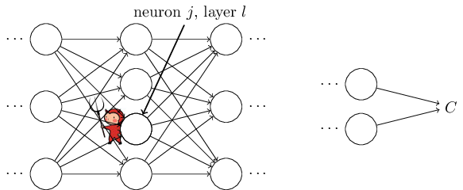

# Lecture 3
# Neural Networks & Backpropagation

*Deep Learning for Visual Recognition · Aarhus University*

These notes build a complete neural network from first principles — from single artificial neurons through the backpropagation algorithm — and then show exactly how PyTorch's autograd engine does the same work automatically.

---

## 1  From Logistic Regression to Neural Networks

In Lecture 2 we learned that logistic regression cannot separate classes that require a non-linear decision boundary — the classic XOR pattern being the simplest example. The fix is to stack multiple logistic units: each unit in the first hidden layer carves out one linear half-space, and a second unit can then combine those half-spaces to produce an arbitrarily complex region. This is precisely how neural networks are built.

The universal approximation theorem formalises the intuition: a fully connected neural network with a single hidden layer of sufficient width can approximate any continuous function on a compact domain to arbitrary precision. In practice, depth (more layers) is more efficient than width: deep networks learn hierarchical features, compressing the same representational power into far fewer parameters than a single wide layer.

> **Why not use perceptrons?** A perceptron fires a hard 0 or 1, based on a step function with zero derivative almost everywhere. Gradient descent requires a non-zero, smooth gradient to update weights. The logistic unit (sigmoid neuron) solves this: its output is a smooth, differentiable probability in $(0, 1)$, so gradient descent can flow through it.

---

## 2  Artificial Neurons

### 2.1  The Perceptron

The perceptron is the simplest artificial neuron. It computes the inner product of its weight vector $\mathbf{w}$ with the input vector $\mathbf{x}$, adds a bias $b$, and fires a 1 if the result exceeds zero:

$$
\text{output} =
\begin{cases}
1 & \text{if } \mathbf{w}^T\mathbf{x} + b > 0 \\
0 & \text{otherwise}
\end{cases}
$$

The weight vector $\mathbf{w}$ can be thought of as a template: the inner product $\mathbf{w}^T\mathbf{x}$ is large when $\mathbf{x}$ resembles $\mathbf{w}$, and small (or negative) when $\mathbf{x}$ is dissimilar. This is why perceptrons can classify images — if the weights represent a prototype of the target class, the neuron fires when an input matches that prototype.

However, the step activation function has zero derivative everywhere (and is undefined at the threshold), making it incompatible with gradient descent. A small change to $\mathbf{w}$ either has no effect on the output, or flips it discontinuously from 0 to 1.

### 2.2  The Logistic Unit

The logistic unit is the perceptron with the step function replaced by a sigmoid:

$$
h_{w,b}(\mathbf{x}) = \sigma(\mathbf{w}^T\mathbf{x} + b) \quad \text{where} \quad \sigma(z) = \frac{1}{1 + \exp(-z)}
$$

[](https://en.wikipedia.org/wiki/File:Logistic-curve.svg)

*Figure – The logistic sigmoid function. [Source: Wikipedia](https://en.wikipedia.org/wiki/File:Logistic-curve.svg).* 

The sigmoid is a smooth S-shaped curve that maps any real number to $(0, 1)$. Its derivative $\sigma'(z) = \sigma(z)(1 - \sigma(z))$ is positive everywhere, so gradient descent can always make progress. The output can be interpreted as the probability $P(y = 1 \mid \mathbf{x})$.

The bias $b$ plays the role of a threshold: a large positive bias makes the neuron easy to activate (it outputs close to 1 even for small inner products); a large negative bias makes it hard to activate. The decision boundary — the set of inputs where $h_{w,b}(\mathbf{x}) = 0.5$ — is the hyperplane $\mathbf{w}^T\mathbf{x} + b = 0$, which is a straight line in 2D.

### 2.3  Decision Boundaries

For a logistic unit with parameters $\mathbf{w} = [1, 1]^T$ and $b = -3$, the decision boundary is the line $x_1 + x_2 - 3 = 0$, i.e. $x_2 = -x_1 + 3$. Points above this line (where $x_1 + x_2 > 3$) are classified as class 1; points below as class 0. No matter how we choose $\mathbf{w}$ and $b$, this boundary is always a straight line — one logistic unit can only ever learn a linear classifier.

```python
import torch
import torch.nn as nn
from matplotlib import pyplot as plt

# A single logistic unit with 2 inputs
# w = [1, 1], b = -3  →  decision boundary: x1 + x2 = 3 <=> x2 = -x1 + 3
unit = nn.Linear(2, 1)                    # wraps wᵀx + b
unit.weight.data = torch.tensor([[1., 1.]])
unit.bias.data   = torch.tensor([-3.])

# Test a few points
points = torch.tensor([
    [1., 1.],   # x1+x2=2 < 3  → should output < 0.5 (class 0)
    [2., 2.],   # x1+x2=4 > 3  → should output > 0.5 (class 1)
    [1.5, 1.5], # x1+x2=3 = 3  → exactly on the boundary → 0.5
])

logits = unit(points)                     # raw wᵀx + b
probs  = torch.sigmoid(logits)            # apply σ
for pt, pr in zip(points, probs):
    cls = 1 if pr > 0.5 else 0
    print(f'x={pt.tolist()}  P(y=1)={pr.item():.3f}  → class {cls}')

# Plot data points and decision boundary
plt.figure(figsize=(6, 4))
plt.scatter(
    points[:, 0],
    points[:, 1],
    c=probs.detach().squeeze(),
    cmap="coolwarm",
    s=100,
)
x_boundary = torch.linspace(0., 3., 100)
y_boundary = 3. - x_boundary           # x1 + x2 = 3
plt.plot(x_boundary, y_boundary, "k--", label="decision boundary")
plt.colorbar(label="P(y=1)")
plt.xlabel("x1")
plt.ylabel("x2")
plt.title("Logistic Regression Decision Boundary")
plt.legend()
plt.show()

# Output:
# x=[1.0, 1.0]  P(y=1)=0.269  → class 0
# x=[2.0, 2.0]  P(y=1)=0.731  → class 1
# x=[1.5, 1.5]  P(y=1)=0.500  → class 0  (tie goes to 0)
```

*Code 1 – A single logistic unit as a binary classifier. The decision boundary $x_1 + x_2 = 3$ separates the two classes. In PyTorch, `nn.Linear` computes $\mathbf{w}^T\mathbf{x} + b$; the sigmoid is applied separately.*

---

## 3  Neural Network Architecture

### 3.1  Stacking Logistic Units

The key insight is simple: the hard cases for a single logistic unit arise when the classes cannot be separated by one hyperplane. But if we first transform the input using several logistic units in parallel (a hidden layer), we can learn a new feature space where a final logistic unit can separate the classes with a straight line.

Consider the XOR problem: class 1 at $(0,1)$ and $(1,0)$, class 0 at $(0,0)$ and $(1,1)$. No single line separates them. But three hidden units can define three half-planes whose combination partitions the space correctly — and a final unit combines their outputs into the correct prediction.

We can think of each hidden unit as learning a feature detector: it fires when the input matches a particular pattern (its weight vector). The output unit then learns to combine these feature responses to make the final decision.

### 3.2  Notation and Layers

The standard notation used throughout the course:

- $\mathbf{a}^{(j)}$ — the activation vector of layer $j$ (a column vector of all neuron outputs in that layer).
- $\mathbf{W}^{(j)}$ — the weight matrix mapping from layer $j$ to layer $j+1$. Shape: $(s_{j+1} \times s_j)$ where $s_j$ is the number of units in layer $j$.
- $\mathbf{b}^{(j)}$ — the bias vector for layer $j+1$. Shape: $(s_{j+1},)$.
- $\mathbf{z}^{(j)}$ — the pre-activation: $\mathbf{z}^{(j)} = \mathbf{W}^{(j-1)}\mathbf{a}^{(j-1)} + \mathbf{b}^{(j-1)}$. This is the input to the activation function.
- $\mathbf{a}^{(j)} = \sigma(\mathbf{z}^{(j)})$ — element-wise sigmoid applied to $\mathbf{z}^{(j)}$.

The first layer is just the input: $\mathbf{a}^{(1)} = \mathbf{x}$. Each subsequent layer applies a linear transformation followed by a non-linear activation. The final layer's output $h_{W,b}(\mathbf{x})$ is the network's prediction.

### 3.3  Why 'Deep' Learning?

Neural networks with more than one hidden layer are called deep. Depth matters because each layer builds on the representations learned by the layer before it:

- Layer 1 (hidden): learns simple features from raw pixels — edges, colour blobs, oriented bars.
- Layer 2 (hidden): combines those simple features into more complex ones — corners, curves, textures.
- Layer 3+ (hidden): assembles object parts — eyes, wheels, doors — from the mid-level features.
- Output layer: classifies based on which high-level features are present.

This hierarchical feature learning is what made deep networks dramatically outperform shallow ones on image tasks. It mirrors how the visual cortex processes information, though neural networks are not biological models.

```python
import torch
import torch.nn as nn

# ── Building an MLP step by step ─────────────────────────────────────

# Architecture: input(3) → hidden1(4) → hidden2(4) → output(2)
# This is a 3-layer network (L=3, not counting input as a layer)

class MLP(nn.Module):
    def __init__(self, input_dim, hidden_dim, output_dim):
        super().__init__()
        # Each nn.Linear wraps W⁽ˡ⁾ and b⁽ˡ⁾
        self.layer1 = nn.Linear(input_dim,  hidden_dim)   # W: (hidden × input)
        self.layer2 = nn.Linear(hidden_dim, hidden_dim)   # W: (hidden × hidden)
        self.layer3 = nn.Linear(hidden_dim, output_dim)   # W: (output × hidden)

    def forward(self, x):
        # Forward propagation: z = Wa + b,  a = σ(z)
        a1 = torch.sigmoid(self.layer1(x))   # hidden layer 1
        a2 = torch.sigmoid(self.layer2(a1))  # hidden layer 2
        a3 = self.layer3(a2)                 # output logits (no activation yet)
        return a3

model = MLP(input_dim=3, hidden_dim=4, output_dim=2)

# Inspect weight shapes
print("Model parameters:")
for name, param in model.named_parameters():
    print(f'{name:20s}  shape: {tuple(param.shape)}')

# layer1.weight       shape: (4, 3)   ← W⁽¹⁾ ∈ ℝ^{4×3}
# layer1.bias         shape: (4,)     ← b⁽¹⁾ ∈ ℝ^4
# layer2.weight       shape: (4, 4)   ← W⁽²⁾ ∈ ℝ^{4×4}
# layer2.bias         shape: (4,)     ← b⁽²⁾ ∈ ℝ^4
# layer3.weight       shape: (2, 4)   ← W⁽³⁾ ∈ ℝ^{2×4}
# layer3.bias         shape: (2,)     ← b⁽³⁾ ∈ ℝ^2

# Total parameters
total = sum(p.numel() for p in model.parameters())
print(f'Total parameters: {total}')   # 4*3+4 + 4*4+4 + 2*4+2 = 46
```

*Code 2 – An MLP built from `nn.Linear` layers. Each layer stores $\mathbf{W}$ and $\mathbf{b}$. The `forward()` method implements the equations $\mathbf{a}^{(j+1)} = \sigma(\mathbf{W}^{(j)}\mathbf{a}^{(j)} + \mathbf{b}^{(j)})$ explicitly.*

---

## 4  Forward Propagation

Forward propagation is the process of computing the network's output from its input. It proceeds layer by layer, applying the same two operations at each step:

$$
\mathbf{z}^{(l+1)} = \mathbf{W}^{(l)} \mathbf{a}^{(l)} + \mathbf{b}^{(l)} \qquad \text{(linear transformation)}
$$

$$
\mathbf{a}^{(l+1)} = \sigma\!\left(\mathbf{z}^{(l+1)}\right) \qquad \text{(element-wise activation)}
$$

Starting from $\mathbf{a}^{(1)} = \mathbf{x}$ and repeating these two equations until the output layer gives the network's prediction $h_{W,b}(\mathbf{x}) = \mathbf{a}^{(L)}$. The intermediate values $\mathbf{z}^{(l)}$ and $\mathbf{a}^{(l)}$ must all be saved during the forward pass because they are needed again during backpropagation.

```python
import torch
import torch.nn as nn

# ── Manual forward propagation vs nn.Module ───────────────────────────
torch.manual_seed(0)

# Define a tiny 2-layer network: 3 → 4 → 2
W1 = torch.randn(4, 3, requires_grad=True)
b1 = torch.zeros(4,    requires_grad=True)
W2 = torch.randn(2, 4, requires_grad=True)
b2 = torch.zeros(2,    requires_grad=True)

x = torch.randn(3)   # one input vector

# Manual forward pass — shows every intermediate value
z1 = W1 @ x + b1                  # pre-activation layer 1,  shape (4,)
a1 = torch.sigmoid(z1)            # activation layer 1,      shape (4,)
z2 = W2 @ a1 + b2                 # pre-activation layer 2,  shape (2,)
a2 = torch.sigmoid(z2)            # output probabilities,    shape (2,)

print('z1:', z1.detach().round(decimals=3))
print('a1:', a1.detach().round(decimals=3))  # values in (0,1)
print('z2:', z2.detach().round(decimals=3))
print('a2:', a2.detach().round(decimals=3))  # values in (0,1)

# All intermediate tensors (z1, a1, z2, a2) are retained in the
# computation graph — PyTorch will use them during backward().

# ── The same with nn.Sequential (cleaner, same computation) ──────────
net = nn.Sequential(
    nn.Linear(3, 4),
    nn.Sigmoid(),
    nn.Linear(4, 2),
    nn.Sigmoid(),
)

# Copy the weights and biases from the manual network to the nn.Sequential network
with torch.no_grad():
    net[0].weight.copy_(W1)
    net[0].bias.copy_(b1)
    net[2].weight.copy_(W2)
    net[2].bias.copy_(b2)

out = net(x)
print('nn.Sequential output:', out.detach().round(decimals=3))
```

*Code 3 – Manual forward propagation showing every intermediate tensor. PyTorch records these in the computation graph automatically. The `nn.Sequential` version is identical in computation but hides the intermediates.*

---

## 5  Loss Functions for Neural Networks

### 5.1  Multi-Class Cross-Entropy

For multi-class classification, the output layer uses a softmax activation that converts $K$ raw logits into $K$ probabilities. The target is a one-hot vector $\mathbf{y}$ (all zeros except a 1 in the position of the correct class). The cross-entropy loss is:

$$
J(W,b) = -\frac{1}{n} \sum_i \sum_k y_k^{(i)} \log h_{W,b}(\mathbf{x}^{(i)})_k
$$

Because $\mathbf{y}$ is one-hot, only one term in the inner sum is non-zero for each training example: the term corresponding to the true class. The loss therefore reduces to $-\log(\text{predicted probability of the correct class})$, which is large when the model is wrong and approaches zero when the model is confident and correct.

### 5.2  Extended Binary Cross-Entropy

When class labels are not mutually exclusive — a photo may contain both a dog and a cat — we use a separate sigmoid per output unit instead of a shared softmax. The extended binary cross-entropy loss then has contributions from both the positive and negative terms for every class:

$$
J(W,b) = -\frac{1}{n} \sum_i \sum_k \left[ y_k^{(i)} \log h_{W,b}(\mathbf{x}^{(i)})_k + (1 - y_k^{(i)}) \log(1 - h_{W,b}(\mathbf{x}^{(i)})_k) \right]
$$

Note that each output unit uses a sigmoid rather than a shared softmax, that is $h_{W,b}(\mathbf{z_k}^{(i)})_k = \sigma(z_k)$.

This is the loss from Lecture 2's logistic regression, applied independently to each of the $K$ output units. Use `nn.BCEWithLogitsLoss` for multi-label problems and `nn.CrossEntropyLoss` for mutually exclusive classes.

```python
import torch
import torch.nn as nn

# ── Multi-class classification (mutually exclusive classes) ───────────
# nn.CrossEntropyLoss = log_softmax + NLLLoss
# IMPORTANT: expects raw LOGITS, not probabilities
ce_loss = nn.CrossEntropyLoss()

logits = torch.tensor([[2.0, 0.5, -1.0]])  # 1 example, 3 classes
target = torch.tensor([0])                 # true class is 0

loss = ce_loss(logits, target)
print(f'Cross-entropy loss: {loss:.4f}')

# Manual calculation to verify:
probs    = torch.softmax(logits, dim=1)
manual   = -torch.log(probs[0, 0])          # -log P(class 0)
print(f'Manual (to verify): {manual:.4f}')  # should match

# ── Multi-label classification (non-exclusive classes) ────────────────
# nn.BCEWithLogitsLoss = sigmoid + binary CE, applied element-wise
bce_loss = nn.BCEWithLogitsLoss()

logits_ml = torch.tensor([[1.5, -0.5, 2.0]])          # 3 independent outputs
target_ml = torch.tensor([[1.0,  0.0, 1.0]])          # classes 0 and 2 are present
print(f'Multi-label BCE:    {bce_loss(logits_ml, target_ml):.4f}')

# ── Quadratic (L2) loss — less common but useful to know ─────────────
mse = nn.MSELoss()
pred   = torch.tensor([[0.8, 0.1, 0.1]])
target_oh = torch.tensor([[1.0, 0.0, 0.0]])
print(f'MSE loss:           {mse(pred, target_oh):.4f}')

# Output:
# Cross-entropy loss: 0.2413
# Manual (to verify): 0.2413
# Multi-label BCE:    0.2675
# MSE loss:           0.0200
```

*Code 4 – Loss functions for neural networks. The critical rule: `nn.CrossEntropyLoss` and `nn.BCEWithLogitsLoss` both expect raw logits, not probabilities. Passing probabilities through softmax before the loss is a common mistake that causes numerical instability.*

---

## 6  Backpropagation

### 6.1  Why Not Just Approximate Gradients Numerically?

Gradient descent requires the partial derivatives $\partial J / \partial \mathbf{W}^{(l)}$ and $\partial J / \partial \mathbf{b}^{(l)}$ for every layer $l$. A naive approach is the finite-difference approximation:

$$
\frac{\partial J}{\partial w_j} \approx \frac{J(\mathbf{w} + \varepsilon \mathbf{e}_j) - J(\mathbf{w})}{\varepsilon}
$$

where $\mathbf{e}_j$ is a unit vector in the direction of weight $w_j$ and $\varepsilon$ is a small number. The problem is computational cost: if the network has one million parameters, this requires one million forward passes per training example per update step. For a dataset of 60,000 images, that is 60 billion forward passes per gradient step — completely intractable.

Backpropagation solves this by computing all partial derivatives in one forward pass followed by one backward pass, at roughly twice the cost of a single forward pass. The key is the chain rule of differentiation.

### 6.2  The $\delta$ (Delta) Error Signal

Backpropagation's central concept is the error signal $\delta_i^{(l)}$, defined as the partial derivative of the loss with respect to the pre-activation $z_i^{(l)}$:

$$
\delta_i^{(l)} = \frac{\partial J}{\partial z_i^{(l)}}
$$

Intuition (the demon analogy from the slides): imagine a demon sitting at neuron $i$ in layer $l$. It adds a small perturbation $\Delta z_i^{(l)}$ to the pre-activation. The resulting change in the loss is $\delta_i^{(l)} \cdot \Delta z_i^{(l)}$. A large $|\delta|$ means that unit has a large influence on the loss — its pre-activation should be corrected. The $\delta$ signals travel backwards through the network, from output to input, accumulating information about how each unit contributed to the error.



*Figure – The demon analogy for the backpropagated error signal. [Source: Neural Networks and Deep Learning](http://neuralnetworksanddeeplearning.com/images/tikz19.png).*

### 6.3  The Four Backpropagation Equations

The backpropagation algorithm is captured in four equations. We state them for the quadratic loss (MSE) here; they generalise to any differentiable loss and any differentiable activation function:

**Equation 1 — Error at the output layer ($L$):**

$$
\boldsymbol{\delta}^{(L)} = (\mathbf{a}^{(L)} - \mathbf{y}) \odot \sigma'(\mathbf{z}^{(L)})
$$

where $\odot$ is element-wise (Hadamard) product and $\sigma'(z) = \sigma(z)(1-\sigma(z))$ is the sigmoid derivative. This compares the network's prediction $\mathbf{a}^{(L)}$ to the target $\mathbf{y}$ and scales by how sensitive the output activation is to changes in $\mathbf{z}$.

**Equation 2 — Error at intermediate layers (backpropagation rule):**

$$
\boldsymbol{\delta}^{(l)} = (\mathbf{W}^{(l)})^T \boldsymbol{\delta}^{(l+1)} \odot \sigma'(\mathbf{z}^{(l)})
$$

The transposed weight matrix $(\mathbf{W}^{(l)})^T$ propagates the error from layer $l+1$ back to layer $l$. The element-wise product with $\sigma'(\mathbf{z}^{(l)})$ then gates the error by the local derivative of the activation function — if a neuron is saturated ($\sigma' \approx 0$), its error contribution is suppressed.

**Equations 3 & 4 — Gradients for weights and biases:**

$$
\frac{\partial J}{\partial W_{ij}^{(l)}} = a_j^{(l)} \cdot \delta_i^{(l+1)}
$$

$$
\frac{\partial J}{\partial b_i^{(l)}} = \delta_i^{(l+1)}
$$

These are the actual update quantities for gradient descent. Equation 3 says: the gradient for weight $W_{ij}^{(l)}$ is the product of the activation that feeds into it ($a_j^{(l)}$) and the error at the unit it feeds into ($\delta_i^{(l+1)}$). This is the classic Hebbian-style update: weights are strengthened when both the pre-synaptic activation and the post-synaptic error are large.

> **Why does equation 2 use the transpose of $\mathbf{W}$?** Each unit in layer $l$ connects to all units in layer $l+1$ via $\mathbf{W}^{(l)}$. To find how much layer $l$'s pre-activation $z_j^{(l)}$ contributed to the errors in layer $l+1$, we sum the errors $\delta_i^{(l+1)}$ weighted by the connection strength $W_{ij}^{(l)}$. Summing over $i$ for a fixed $j$ is exactly the $j$-th element of $(\mathbf{W}^{(l)})^T \boldsymbol{\delta}^{(l+1)}$. The transpose arises naturally from the chain rule.

### 6.4  A Complete Worked Example

The following code implements backpropagation from scratch — no autograd — for a tiny 2-layer network. Every intermediate value is computed and printed. Running this alongside the equations above is the best way to make backpropagation concrete.

```python
import torch

# ── Manual backpropagation for a 2-layer network ──────────────────────
# Architecture: input(2) → hidden(3) → output(1)
# Loss: MSE (quadratic)

torch.manual_seed(42)
W1 = torch.randn(3, 2)    # W⁽¹⁾ ∈ ℝ^{3×2}
b1 = torch.zeros(3)       # b⁽¹⁾ ∈ ℝ^3
W2 = torch.randn(1, 3)    # W⁽²⁾ ∈ ℝ^{1×3}
b2 = torch.zeros(1)       # b⁽²⁾ ∈ ℝ^1

# One training example
x = torch.tensor([0.5, -0.3])
y = torch.tensor([1.0])

def sigmoid(z):    return 1 / (1 + torch.exp(-z))
def sigmoid_d(z):  return sigmoid(z) * (1 - sigmoid(z))  # σ'(z)

# ── FORWARD PASS ──────────────────────────────────────────────────────
z1 = W1 @ x + b1              # pre-activation layer 1,  (3,)
a1 = sigmoid(z1)              # activation layer 1,      (3,)
z2 = W2 @ a1 + b2             # pre-activation output,   (1,)
a2 = sigmoid(z2)              # network output ŷ,        (1,)

loss = 0.5 * ((a2 - y) ** 2).sum()   # MSE loss
print(f'Forward: ŷ={a2.item():.4f}, y={y.item()}, loss={loss.item():.4f}')

# ── BACKWARD PASS ─────────────────────────────────────────────────────
# Equation 1: error at output layer
delta2 = (a2 - y) * sigmoid_d(z2)             # δ⁽ᴸ⁾ = (ŷ - y) ⊙ σ'(z⁽ᴸ⁾)

# Equation 3 & 4: gradients for W2 and b2
dW2 = delta2.unsqueeze(1) * a1.unsqueeze(0)   # ∂J/∂W⁽²⁾ = δ⁽³⁾ aᵀ⁽²⁾
db2 = delta2                                  # ∂J/∂b⁽²⁾ = δ⁽³⁾

# Equation 2: backpropagate error to layer 1
delta1 = (W2.T @ delta2) * sigmoid_d(z1)      # δ⁽²⁾ = W⁽²⁾ᵀ δ⁽³⁾ ⊙ σ'(z⁽²⁾)

# Equation 3 & 4: gradients for W1 and b1
dW1 = delta1.unsqueeze(1) * x.unsqueeze(0)    # ∂J/∂W⁽¹⁾ = δ⁽²⁾ aᵀ⁽¹⁾
db1 = delta1                                  # ∂J/∂b⁽¹⁾ = δ⁽²⁾

print(f'dW2: {dW2}')
print(f'dW1: {dW1}')

# ── VERIFY WITH PYTORCH AUTOGRAD ──────────────────────────────────────
W1_t = W1.clone().requires_grad_(True)
b1_t = b1.clone().requires_grad_(True)
W2_t = W2.clone().requires_grad_(True)
b2_t = b2.clone().requires_grad_(True)

a1_t = sigmoid(W1_t @ x + b1_t)
a2_t = sigmoid(W2_t @ a1_t + b2_t)
loss_t = 0.5 * ((a2_t - y) ** 2).sum()
loss_t.backward()

print('\nManual dW2 matches autograd:', torch.allclose(dW2, W2_t.grad, atol=1e-6))
print('Manual dW1 matches autograd:', torch.allclose(dW1, W1_t.grad, atol=1e-6))
# Both should print True
```

*Code 5 – Backpropagation implemented from scratch. Each line directly corresponds to one of the four backprop equations. The final section verifies all manual gradients against PyTorch's autograd — they match exactly.*

---

## 7  Practical Training Issues

### 7.1  Saturation and the Vanishing Gradient Problem

Saturation occurs when a sigmoid neuron's input $z^{(l)}$ is very large in magnitude. In this regime the sigmoid's derivative $\sigma'(z) \approx 0$, meaning almost no gradient flows through that neuron. Looking at the backprop equations, $\boldsymbol{\delta}^{(l)}$ is multiplied element-wise by $\sigma'(\mathbf{z}^{(l)})$ at every layer. In a deep network with $L$ layers, the gradient reaching the first layer is a product of $L$ such terms — each less than 0.25 (the maximum of $\sigma'$) — so the gradient shrinks exponentially as it travels backwards. Early layers learn extremely slowly or not at all. This is the vanishing gradient problem.

An easy and practical solution is to replace sigmoid with ReLU in hidden layers. ReLU has a constant derivative of 1 for positive inputs, so gradients pass through unchanged. This is why modern networks use ReLU by default. More sophisticated solutions — residual connections and batch normalisation — are covered in Lectures 5–7.

```python
import torch
import torch.nn as nn

# ── Demonstrating gradient flow with sigmoid vs ReLU ──────────────────
torch.manual_seed(0)

def build_network(activation, depth=10):
    layers = []
    for _ in range(depth):
        layers += [nn.Linear(64, 64), activation()]
    layers.append(nn.Linear(64, 1))
    return nn.Sequential(*layers)

x      = torch.randn(1, 64)
target = torch.ones(1, 1)

for act_name, act_cls in [('Sigmoid', nn.Sigmoid), ('ReLU', nn.ReLU)]:
    net    = build_network(act_cls, depth=10)
    loss   = nn.MSELoss()(net(x), target)
    loss.backward()

    # Look at gradient magnitude in the FIRST layer
    first_grad = net[0].weight.grad.abs().mean().item()
    print(f'{act_name:10s}  first-layer gradient mean: {first_grad:.12f}')

# Sigmoid → first-layer gradient is ~0.0000000001 (vanished over 10 layers)
# ReLU    → first-layer gradient is ~0.00001      (healthier, doesn't vanish completely)
```

*Code 6 – Demonstrating the vanishing gradient problem. With 10 sigmoid layers, the gradient at the first layer is effectively zero. With ReLU, gradients are healthier throughout the network.*

### 7.2  Overfitting and Regularisation

Neural networks are highly prone to overfitting. A network for MNIST with two hidden layers of 30 units each has ~25,000 parameters but only 60,000 training images — a ratio of less than 3 images per parameter. State-of-the-art networks have billions of parameters. Without regularisation, they memorise the training set.

The regularised loss for a neural network adds an L2 penalty summed over all weights across all layers:

$$
J_\text{reg}(W,b) = J(W,b) + \frac{\lambda}{2n} \sum_l \sum_{ij} \left(W_{ij}^{(l)}\right)^2
$$

The effect on backpropagation is simple: the gradient for each weight $W_{ij}^{(l)}$ gains an extra term $+\lambda W_{ij}^{(l)}$. This shrinks each weight towards zero at every step, hence 'weight decay'. More regularisation techniques — dropout, early stopping, batch normalisation, data augmentation — are covered in Lecture 6.

### 7.3  Detecting Overfitting with Loss Curves

The standard diagnostic is to plot training loss and validation loss over epochs on the same graph:

- **Both decreasing**: the model is still learning — continue training.
- **Training loss decreasing, validation loss plateauing**: the model is approaching its best generalisation — consider stopping soon.
- **Training loss decreasing, validation loss increasing**: the model is overfitting — stop training here (early stopping) or add regularisation.


*Figure – Early stopping identified from training and validation loss curves. [Source: Medium](https://miro.medium.com/v2/resize:fit:1100/format:webp/1*ffl8ETcZxLKgQrTDDpcv5A.png).*

```python
import torch
import torch.nn as nn
from torch.utils.data import DataLoader, TensorDataset, random_split
from matplotlib import pyplot as plt

# ── Training loop with early stopping ─────────────────────────────────
torch.manual_seed(0)
N_per_class = 500

# Class 0: points near the origin
angle_inner = 2 * torch.pi * torch.rand(N_per_class)
radius_inner = 0.8 * torch.sqrt(torch.rand(N_per_class))
X_inner = torch.stack((radius_inner * torch.cos(angle_inner),
                       radius_inner * torch.sin(angle_inner)), dim=1)

# Class 1: points farther away, forming a ring
angle_outer = 2 * torch.pi * torch.rand(N_per_class)
radius_outer = torch.sqrt(1.2**2 + (2.0**2 - 1.2**2) * torch.rand(N_per_class))
X_outer = torch.stack((radius_outer * torch.cos(angle_outer),
                       radius_outer * torch.sin(angle_outer)), dim=1)

# Join the two classes into a single dataset
X = torch.cat((X_inner, X_outer))
y = torch.cat((torch.zeros(N_per_class), torch.ones(N_per_class))).long()
dataset = TensorDataset(X, y)
train_ds, val_ds = random_split(dataset, [800, 200])

# A neural network can learn the nonlinear circular decision boundary.
model = nn.Sequential(
    nn.Linear(2, 64), nn.ReLU(),
    nn.Linear(64, 64), nn.ReLU(),
    nn.Linear(64, 2),
)
optimiser = torch.optim.SGD(model.parameters(), lr=0.1, weight_decay=1e-3)
loss_fn = nn.CrossEntropyLoss()

train_losses, val_losses = [], []
best_val_loss, best_epoch = float('inf'), 0
best_state = None
patience = 8
min_delta = 5e-3
epochs_without_improvement = 0

for epoch in range(100):
    model.train()
    epoch_loss = 0
    for X_b, y_b in DataLoader(train_ds, batch_size=64, shuffle=True):
        optimiser.zero_grad()
        loss = loss_fn(model(X_b), y_b)
        loss.backward()
        optimiser.step()
        epoch_loss += loss.item()
    train_losses.append(epoch_loss / len(train_ds) * 64)

    model.eval()
    with torch.no_grad():
        X_val, y_val = val_ds[:]
        val_loss = loss_fn(model(X_val), y_val).item()
    val_losses.append(val_loss)

    # Early stopping: Stop after `patience` epochs without a meaningful validation improvement.
    if val_loss < best_val_loss - min_delta:
        best_val_loss = val_loss
        best_epoch = epoch
        best_state = {k: v.clone() for k, v in model.state_dict().items()}
        epochs_without_improvement = 0
    else:
        epochs_without_improvement += 1
        if epochs_without_improvement >= patience:
            print(f'Early stopping at epoch {epoch + 1}')
            break

print(f'Best epoch: {best_epoch + 1}  (val loss: {best_val_loss:.4f})')
print(f'Epochs actually run: {len(train_losses)}')

# Restore the best weights, rather than the weights from the final epoch.
model.load_state_dict(best_state)

# Plot training and validation loss curves
epochs = range(1, len(train_losses) + 1)
plt.figure(figsize=(8, 4))
plt.plot(epochs, train_losses, label='Train Loss')
plt.plot(epochs, val_losses, label='Validation Loss')
plt.axvline(best_epoch + 1, color='r', linestyle='--', label='Best Epoch')
plt.xlabel('Epoch')
plt.ylabel('Loss')
plt.title('Early Stopping on Concentric Circles')
plt.legend()
plt.show()

# Plot data points and decision boundary
plt.figure(figsize=(6, 6))
plt.scatter(X_inner[:, 0], X_inner[:, 1], color='blue', alpha=0.5, label='Class 0')
plt.scatter(X_outer[:, 0], X_outer[:, 1], color='orange', alpha=0.5, label='Class 1')
xx, yy = torch.meshgrid(torch.linspace(-2, 2, 200), torch.linspace(-2, 2, 200), indexing='ij')
grid = torch.stack((xx.flatten(), yy.flatten()), dim=1)
with torch.no_grad():
    logits = model(grid)
    probs = torch.softmax(logits, dim=1)[:, 1].reshape(xx.shape)
plt.contourf(xx, yy, probs, levels=50, cmap='coolwarm', alpha=0.6)
plt.colorbar(label='P(Class 1)')
plt.xlabel('x1')
plt.ylabel('x2')
plt.title('Decision Boundary Learned by Neural Network')
plt.legend()
```

*Code 7 – Training loop with validation monitoring and early stopping. The best model state is saved whenever validation loss improves; we restore it at the end rather than using the final (possibly overfit) weights.*

### 7.4  Stochastic Gradient Descent

Full-batch gradient descent computes the loss over the entire training set before updating the weights. For a dataset of millions of images, this is impractically slow. Stochastic Gradient Descent (SGD) instead computes the loss and gradient over a small mini-batch of examples (typically 32–512) and updates the weights immediately. This gives:

- Much faster updates — the model sees many mini-batches per pass over the data.
- Gradient noise from the mini-batch acts as a regulariser, helping escape sharp local minima.
- Efficient GPU utilisation — matrix operations over a mini-batch are highly parallelised.

In PyTorch, all optimisers operate on mini-batches by default. You control the batch size via the `DataLoader`'s `batch_size` argument.

---

## 8  Computational Graphs and Automatic Differentiation

### 8.1  The Problem with Manual Backpropagation

The four backprop equations we derived assume a specific architecture (fully connected layers with sigmoid activations) and a specific loss (MSE). If we change anything — add a convolutional layer, switch to cross-entropy, use ReLU — we have to re-derive the equations from scratch. This was the workflow before modern deep learning frameworks and it was enormously tedious and error-prone.

The solution is automatic differentiation (autograd): build a computation graph during the forward pass and automatically compute all gradients during the backward pass. The chain rule does all the work — you just define the computation and PyTorch handles the differentiation.

### 8.2  Computational Graphs

A computational graph represents a mathematical expression as a directed acyclic graph of primitive operations. Each node is an operation; edges carry the values and their gradients. Consider $f(x, y, z) = (x + y) \cdot z$:

- **Forward pass**: evaluate left to right. $q = x + y = -2 + 5 = 3$; $f = q \cdot z = 3 \cdot 4 = 12$.
- **Backward pass (chain rule)**: starting from $\partial f/\partial f = 1$, propagate gradients right to left.
- At the multiply gate: $\partial f/\partial q = z = 4$, $\partial f/\partial z = q = 3$.
- At the add gate: $\partial q/\partial x = 1$, $\partial q/\partial y = 1$. By chain rule: $\partial f/\partial x = (\partial f/\partial q)(\partial q/\partial x) = 4 \cdot 1 = 4$.

Each gate needs only two things: its local gradient (derivable from the forward-pass values), and the gradient flowing back from the layer above. This is exactly what PyTorch's autograd does for every operation in your network.

```python
import torch

# ── Computational graph example: f(x,y,z) = (x + y) * z ──────────────
x = torch.tensor(-2.0, requires_grad=True)
y = torch.tensor( 5.0, requires_grad=True)
z = torch.tensor( 4.0, requires_grad=True)

# Forward pass — PyTorch builds the graph as we compute
q = x + y        # add gate
f = q * z        # multiply gate

print(f'Forward: q={q.item()}, f={f.item()}')  # q=3, f=12

# Backward pass — one call propagates all gradients
f.backward()

# Chain rule results:
# ∂f/∂x = z = 4  (gradient flows through q to x via add gate)
# ∂f/∂y = z = 4  (same path)
# ∂f/∂z = q = 3  (direct from multiply gate)
print(f'∂f/∂x = {x.grad.item()}')   # 4.0
print(f'∂f/∂y = {y.grad.item()}')   # 4.0
print(f'∂f/∂z = {z.grad.item()}')   # 3.0

# ── Gradient check: verify with finite differences ────────────────────
eps = 1e-5
for var, name in [(x, 'x'), (y, 'y'), (z, 'z')]:
    with torch.no_grad():
        var.data += eps
        f_plus = (x + y) * z
        var.data -= 2 * eps
        f_minus = (x + y) * z
        var.data += eps          # restore
        fd_grad = (f_plus - f_minus) / (2 * eps)
    print(f'Finite diff ∂f/∂{name} ≈ {fd_grad.item():.4f}  (autograd: {var.grad.item():.4f})')
```

*Code 8 – PyTorch autograd on the simple $(x+y)\cdot z$ example from the slides. The `backward()` call computes all gradients in one pass. The finite-difference check confirms the results.*

### 8.3  The Chain Rule in a Neuron

The same principle scales to an entire neural network. Each layer is a node in the computation graph. During the backward pass, each node receives the gradient of the loss with respect to its output — the **upstream gradient** — and applies the chain rule:

$$
\boxed{\text{gradient w.r.t. input} = \text{upstream gradient} \times \text{local derivative}}
$$

For a scalar node $z=f(x)$, this is simply:

$$
\frac{\partial L}{\partial x}
=
\frac{\partial L}{\partial z}
\frac{\partial z}{\partial x}
$$

A node applies this rule to each of its inputs. For a linear layer $\mathbf{z}=\mathbf{W}\mathbf{x}+\mathbf{b}$, the inputs are $\mathbf{x}$, $\mathbf{W}$, and $\mathbf{b}$. Given the upstream gradient $\frac{\partial L}{\partial\mathbf{z}}$, the chain rule gives:

$$
\frac{\partial L}{\partial \mathbf{W}}
=
\frac{\partial L}{\partial \mathbf{z}}\mathbf{x}^T,
\qquad
\frac{\partial L}{\partial \mathbf{b}}
=
\frac{\partial L}{\partial \mathbf{z}},
\qquad
\frac{\partial L}{\partial \mathbf{x}}
=
\mathbf{W}^T\frac{\partial L}{\partial \mathbf{z}}
$$

The first two are gradients for the layer's trainable parameters; the last ($\frac{\partial L}{\partial \mathbf{x}}$) is propagated backward to the preceding node (i.e., it becomes the upstream gradient of that node).

For a sigmoid node $z=\sigma(s)$, the local derivative is:

$$
\frac{\partial z}{\partial s}
=
\sigma(s)(1-\sigma(s))
$$

Multiplying it by the upstream gradient gives:

$$
\frac{\partial L}{\partial s}
=
\underbrace{\frac{\partial L}{\partial z}}_{\text{upstream gradient}}
\underbrace{\sigma(s)(1-\sigma(s))}_{\text{local derivative}}
$$

Backpropagation repeatedly applies this rule from node to node through the computation graph. PyTorch's autograd engine performs these same chain-rule computations automatically.


```python
import torch
import torch.nn as nn

# ── PyTorch autograd on a full MLP — nothing manual needed ────────────
torch.manual_seed(0)

model = nn.Sequential(
    nn.Linear(4, 8), nn.Sigmoid(),
    nn.Linear(8, 8), nn.Sigmoid(),
    nn.Linear(8, 3),
)

x      = torch.randn(16, 4)   # mini-batch of 16 examples
target = torch.randint(0, 3, (16,))

# Forward pass builds the computation graph
logits = model(x)
loss   = nn.CrossEntropyLoss()(logits, target)

# Backward pass — ONE call computes ALL gradients
loss.backward()

# Every parameter now has its gradient populated
for name, param in model.named_parameters():
    print(f'{name:20s}  grad norm: {param.grad.norm():.4f}')

# ── What autograd tracks ──────────────────────────────────────────────
# Every tensor created from a requires_grad=True tensor
# records the operation that created it. This forms the graph.
# backward() traverses the graph in reverse, applying the chain rule
# at each node using the stored forward-pass values.

# You can inspect the graph:
x_single = torch.randn(2, requires_grad=True)
z = (x_single ** 2).sum()
print(z.grad_fn)                    # shows the operation: SumBackward
print(z.grad_fn.next_functions)     # shows previous ops in the graph
```

*Code 9 – PyTorch autograd on a full MLP. One `backward()` call computes all gradients. The comment block explains what PyTorch is actually tracking — every operation between `requires_grad` tensors is recorded in the computation graph.*

### 8.4  Backpropagation for Convolution

The same chain-rule logic applies when the network includes convolutional layers. For a 2D convolution with input $X$, filter $F$, and output $O$:

- **Forward pass**: $O = \text{conv}(X, F)$ — each output element is a dot product between a patch of $X$ and $F$.
- **During backward**: we receive $\partial L/\partial O$ from the layer above.
- $\partial L/\partial F$ (gradient w.r.t. filter weights) $= \text{conv}(X, \partial L/\partial O)$ — a convolution of the input with the upstream gradient.
- $\partial L/\partial X$ (gradient w.r.t. input, for the layer below) $= \text{full conv}(\text{rot}_{180}(F), \partial L/\partial O)$ — a 'full' convolution with the filter rotated 180°.

The remarkable result is that the backward pass through a convolution is itself a convolution. PyTorch implements this automatically — you never need to derive or code it manually. But understanding that it is 'just the chain rule applied to a dot product' is conceptually important.

```python
import torch
import torch.nn as nn

# ── Autograd through a convolutional layer ────────────────────────────
# PyTorch handles backprop for conv exactly as described above.
# We can verify by checking gradient shapes.

conv = nn.Conv2d(in_channels=1, out_channels=1, kernel_size=2, bias=False)

# Input: 1 image, 1 channel, 3×3
X = torch.randn(1, 1, 3, 3, requires_grad=True)
O = conv(X)                      # output: (1, 1, 2, 2)
loss = O.sum()                   # simple scalar loss
loss.backward()

print('Input grad shape:  ', X.grad.shape)           # (1, 1, 3, 3) = same as X
print('Filter grad shape: ', conv.weight.grad.shape) # (1, 1, 2, 2) = same as F

# ∂L/∂F = conv(X, ∂L/∂O)  — verify manually
# ∂L/∂O = all ones (since loss = O.sum())
dL_dO = torch.ones_like(O)

# Manual ∂L/∂F: for a sum loss, this is just the sum of all input patches
# covered by each filter position — which equals a 'valid' conv of X with dL/dO
manual_dF = nn.functional.conv2d(X.detach(), dL_dO, padding=0)
print('Manual dF matches autograd:', torch.allclose(manual_dF, conv.weight.grad, atol=1e-5))
```

*Code 10 – Autograd through a convolutional layer. The gradient of the filter $\partial L/\partial F$ has the same shape as $F$, and the gradient of the input $\partial L/\partial X$ has the same shape as $X$. PyTorch computes both automatically via the two-convolution backward formula.*

---

## 9  Summary

This lecture built the complete machinery for training neural networks from scratch. The table below maps every key concept to its PyTorch equivalent:

| Concept | What it does | PyTorch |
|---|---|---|
| Logistic unit | Smooth binary classifier: $\sigma(\mathbf{w}^T\mathbf{x} + b)$ | `nn.Linear` + `torch.sigmoid` |
| MLP / neural net | Stack of logistic units with non-linear acts | `nn.Sequential` / `nn.Module` |
| Forward propagation | Compute $\mathbf{a}^{(l+1)} = \sigma(\mathbf{W}^{(l)}\mathbf{a}^{(l)} + \mathbf{b}^{(l)})$ per layer | `model(x)` — builds comp. graph |
| Cross-entropy loss | Penalise wrong class predictions | `nn.CrossEntropyLoss()` |
| Multi-label loss | Independent sigmoid per class | `nn.BCEWithLogitsLoss()` |
| $\delta$ error signal | $\partial J/\partial \mathbf{z}$ — sensitivity of loss to pre-activation | Computed via `.backward()` |
| Backpropagation | One backward pass gives all gradients | `loss.backward()` |
| Autograd | Automatic differentiation via comp. graphs | `requires_grad=True` tensors |
| Weight decay (L2) | Regularise to prevent overfitting | `weight_decay=` in optimiser |
| Early stopping | Stop when val loss stops improving | Save best `model.state_dict()` |
| SGD / mini-batch | Fast updates over small batches | `torch.optim.SGD` + `DataLoader` |
| ReLU | Non-saturating activation for deep networks | `nn.ReLU()` |

The two most important ideas to carry forward: (1) backpropagation is just the chain rule applied systematically through a computation graph — there is no magic, only derivatives; and (2) PyTorch's autograd implements this automatically for any differentiable computation you can express in Python, which is what makes experimenting with novel architectures so easy. In Lecture 4, convolution is introduced as a new type of node in the computation graph — and autograd handles its gradients just as transparently.

---

## 10  Execises

### Exercise 1 — Forward Pass by Hand

A small neural network has the following architecture: 2 inputs, one hidden layer with 2 units (sigmoid activation), and 1 output unit (sigmoid activation). The weights and biases are:

$$
\mathbf{W}^{(1)} = \begin{bmatrix} 1 & 0 \\ 0 & 1 \end{bmatrix}, \quad \mathbf{b}^{(1)} = \begin{bmatrix} -0.5 \\ -0.5 \end{bmatrix}, \quad \mathbf{W}^{(2)} = \begin{bmatrix} 1 & 1 \end{bmatrix}, \quad b^{(2)} = -1.5
$$

Given input $\mathbf{x} = [1, 1]^T$:

**(a)** Compute the pre-activations $\mathbf{z}^{(2)} = \mathbf{W}^{(1)}\mathbf{x} + \mathbf{b}^{(1)}$.

**(b)** Compute the hidden layer activations $\mathbf{a}^{(2)} = \sigma(\mathbf{z}^{(2)})$. Use $\sigma(0.5) \approx 0.622$.

**(c)** The input to the output unit (sigmoid activation) is $\mathbf{W}^{(2)}\mathbf{a}^{(2)} + b^{(2)} = −0.256$. What class would the network predict?

---

### Exercise 2 — Perceptron vs Logistic Unit

**(a)** Explain why the perceptron cannot be trained with gradient descent, but the logistic unit can.

**(b)** A logistic unit with weights $\mathbf{w} = [2, -1]^T$ and bias $b = 0$ classifies a point $\mathbf{x} = [1, 3]^T$. Compute the raw score $z = \mathbf{w}^T\mathbf{x} + b$ and the predicted probability $\sigma(z)$. What class is predicted?

**(c)** For the same unit, write down the equation of the decision boundary and describe it geometrically. (At the exam, you would be asked to point the correct plot of the decision boundary among two or more options).

---

### Exercise 3 — Counting Parameters

A fully connected network has the following architecture: input layer with 784 units, two hidden layers with 256 and 128 units respectively (both with sigmoid activation), and an output layer with 10 units. Every layer has a bias vector.

**(a)** How many learnable parameters does the first hidden layer have (weights + biases)?

**(b)** Write down the total parameter count for the entire network.

**(c)** A student proposes doubling the width of both hidden layers to 512 and 256 units. By approximately what factor does the total parameter count increase?

---

## Exercise 4 — Reading a Computational Graph

Consider the scalar computation:

$$
z = (x + w) \cdot y, \qquad L = (z - 1)^2
$$

where $x = 1$, $w = 2$, $y = 3$.

**(a)** Draw the computational graph for $L$, labelling each intermediate node. (At the exam, you would be asked to point the correct computational graph among two or more options).

**(b)** Compute the value of each node in the forward pass.

**(c)** Using the chain rule, compute $\partial L / \partial w$ by working backwards through the graph.

**(d)** If $w$ is a learnable parameter and the learning rate is $\alpha = 0.1$, what is the updated value of $w$ after one gradient descent step?

---

## Exercise 5 — Saturation and Vanishing Gradients

**(a)** What does it mean for a neuron to be saturated?

**(b)** The derivative of the sigmoid is $\sigma'(z) = \sigma(z)(1 - \sigma(z))$. What is the approximate value of $\sigma'(z)$ for $z = 0$, $z = 10$, and $z = -10$. What do these values tell you about gradient flow?

**(c)** Explain why saturation is particularly problematic in deep networks (many layers) compared to shallow networks (one hidden layer).

**(d)** ReLU was introduced partly to address saturation. For which input values does ReLU also produce a zero gradient, and why is this considered less problematic than sigmoid saturation?

---

## Exercise 6 — Reading PyTorch Autograd Code
*Note:* You will learn about PyTorch Autograd in more detail in a future lab.

```python
import torch

x = torch.tensor([2.0], requires_grad=True)
w = torch.tensor([3.0], requires_grad=True)

z = x * w
L = z ** 2

L.backward()
```

**(a)** What are the values of `x.grad` and `w.grad` after `L.backward()`? Derive them analytically using the chain rule.

**(b)** If you called `L.backward()` a second time without clearing gradients, what would happen to `x.grad`?

**(c)** What is the purpose of `requires_grad=True`? What would happen if you set `requires_grad=False` for both `x` and `w`?

**(d)** A student adds `with torch.no_grad():` around the `z = x * w` line. What effect does this have, and when is this pattern useful in practice?

---

## Exercise 7 — Cross-Entropy Loss and One-Hot Targets
In the following, we use zero-indexing.

A 4-class network produces logits $\mathbf{z} = [1.0,\ 3.0,\ 0.5,\ 2.0]$ for a single training example whose true class is class 2.

**(a)** Write down the one-hot encoding of the target.

**(b)** Which class has the highest softmax probability. You may use $e^1 \approx 2.72$, $e^3 \approx 20.09$, $e^{0.5} \approx 1.65$, $e^2 \approx 7.39$.

**(d)** Explain intuitively why the cross-entropy loss is larger when the model assigns high probability to the wrong class than when it is merely uncertain.

---

## Exercise 8 — Backpropagation: Theoretical Understanding

**(a)** Backpropagation computes the gradient of the loss with respect to all weights. What mathematical principle makes this possible, and why is it efficient?

**(b)** A network has 1 million parameters. How many forward passes does numerical gradient approximation require to compute the full gradient? How many does backpropagation require?

**(c)** During backpropagation through a linear layer $\mathbf{z} = \mathbf{W}\mathbf{x} + \mathbf{b}$, the gradient of the loss with respect to the weights is $\partial L/\partial \mathbf{W} = \boldsymbol{\delta} \cdot \mathbf{x}^T$, where $\boldsymbol{\delta} = \partial L/\partial \mathbf{z}$. Explain in words what this expression means: why does the weight gradient depend on $\mathbf{x}$?

**(d)** What is the vanishing gradient problem, and in which part of the network (early or late layers) does it first manifest during backpropagation?

## References

- Nielsen, M. (2015). *Neural Networks and Deep Learning*. Free online book. Chapters 2–3. neuralnetworksanddeeplearning.com
- Goodfellow, I., Bengio, Y., & Courville, A. (2016). *Deep Learning*. MIT Press. Chapters 6 and 8.
- PyTorch Autograd tutorial: [pytorch.org/tutorials/beginner/blitz/autograd_tutorial.html](pytorch.org/tutorials/beginner/blitz/autograd_tutorial.html)
- CS231n Stanford notes (Karpathy): [cs231n.github.io/optimization-2/](cs231n.github.io/optimization-2/)
- Backprop for convolutions (visual): [medium.com/@pavisj/convolutions-and-backpropagations](https://pavisj.medium.com/convolutions-and-backpropagations-46026a8f5d2c)